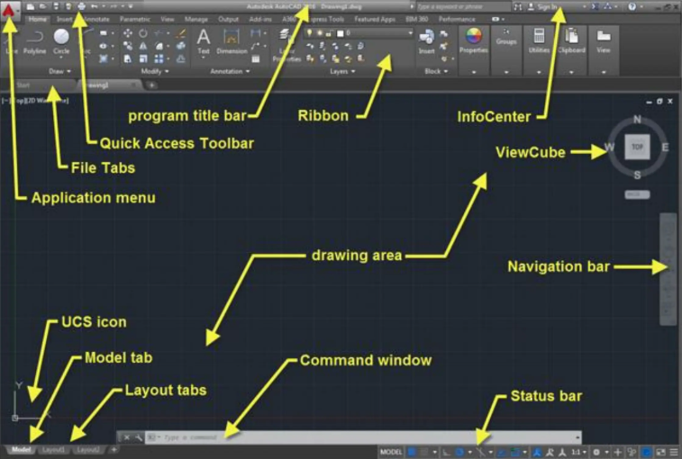
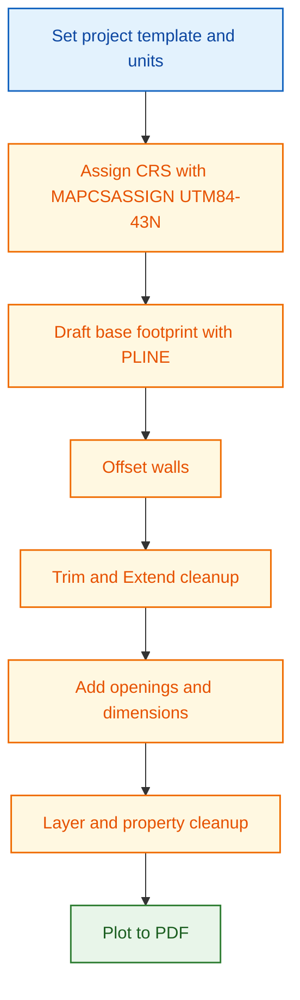
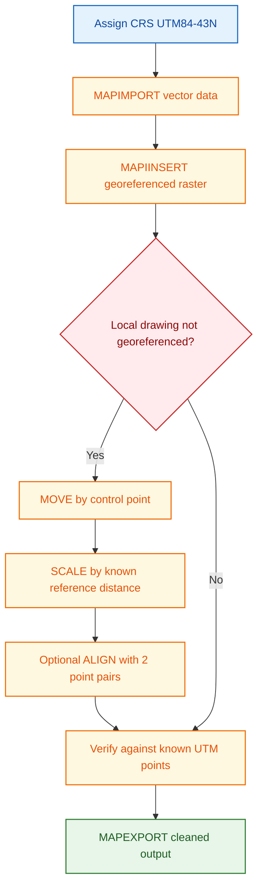
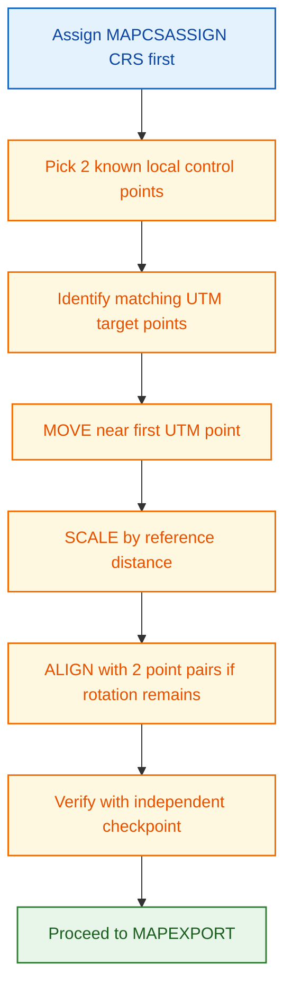

<!-- prettier-ignore -->
# AutoCAD Civil 3D Reference

This page explains high-impact Civil 3D drafting and GIS interoperability operations in simple language.

This reference is intentionally basic-level. It focuses on drafting and CAD-GIS exchange, not advanced civil modeling.

## What This Page Covers

- Interface overview.
- Must-know basics to get started.
- Must-know basic configuration (CRS first).
- High-impact command cards for beginner workflows.
- Simple drafting workflow.
- Simple GIS interoperability and georeferencing workflow.

## What AutoCAD Civil 3D Is

AutoCAD Civil 3D is an AutoCAD-based platform that combines drafting tools with civil and mapping utilities.
In this handbook context, it is used primarily as a drafting and CAD-GIS exchange tool, not as an advanced corridor/surface modeling platform.

Typical use cases:

- Building plan drafting.
- Section and elevation preparation.
- Road context drawing.
- CAD and GIS data exchange.

In this training context, the highest-value commands are MAPCSASSIGN, MAPIMPORT, MAPIINSERT, MAPEXPORT, and ALIGN (for simple georeference correction).

## Overview of the Interface

Make sure to change the workspace to "Drafting and Annotation" for a simpler interface focused on drafting and CAD-GIS exchange.
The interface elements below are the most useful for beginner drafting and map interoperability work:

- Program Title Bar: Displays the program name and current drawing title; includes minimize, maximize, and close buttons at the top of the window.
- Quick Access Toolbar: Customizable toolbar with shortcuts to frequently used commands like Save, Open, Undo, Redo, and Zoom; customize via right-click.
- File Tabs: Located at the top, allowing quick switching between open files; right-click to close tabs.
- Application Menu: Found in the top-left corner, provides commands for creating, opening, saving, and printing drawings.
- UCS Icon: Positioned at the bottom-left, shows the current User Coordinate System; click to open UCS dialog for changes.
- Model Tab: Located at the bottom of the AutoCAD window; used to work in model space where 2D and 3D objects are created and edited.
- Layout Tabs: Also at the bottom; used to manage paper space layouts for creating and printing scaled drawings.
- Ribbon: A graphical interface replacing menus and toolbars, organized into tabs with related commands accessible by clicking buttons.
- InfoCenter: Positioned at the top-right corner; provides quick access to help, tutorials, and resources.
- ViewCube: Allows rotation and zooming of the drawing view, and changing the perspective.
- Drawing Area: Central part of the AutoCAD window where drawings are created and edited.
- Navigation Bar: Located at the bottom, provides quick access to Pan, Zoom, and Orbit tools.
- Command Window: Also at the bottom, lets you enter commands by typing and pressing Enter.
- Status Bar: Displays information about the current drawing and provides quick access to settings like grid, snap, and ortho mode.

## Must-Know Basics to Get Started

1. Start from the project template and save to the project Drawings folder.
2. Set drawing units to meters before drafting.
3. Set layer strategy before linework (base, walls, openings, annotation, GIS-import).
4. Turn on object snaps for precise drafting.
5. Keep one master drawing and export/share copies.

## Must-Know Basic Configuration

Assumption for this workshop: AOI falls in UTM Zone 43N. For any different AOI, assign the correct UTM zone before import/export.

| Setting area               | Workshop default                                          | Why it matters                                       |
| -------------------------- | --------------------------------------------------------- | ---------------------------------------------------- |
| Coordinate system          | MAPCSASSIGN to UTM84-43N (for this AOI)                   | Prevents major location mismatch during GIS exchange |
| Units                      | Decimal, insertion scale in meters                        | Keeps drafting and GIS distances consistent          |
| OSNAP (F3)                 | Endpoint, Midpoint, Intersection, Perpendicular           | Reduces geometry errors                              |
| ORTHO (F8) and Polar (F10) | ON while drafting straight walls and offsets              | Improves speed and line quality                      |
| Layer discipline           | Separate layers for base, design, annotation, GIS-import  | Improves readability and export control              |
| XREF fade                  | Use XDWGFADECTL around 60 for referenced background plans | Improves tracing visibility                          |

## Core Drafting Concepts

- Geometry should be clean and connected.
- Closed boundaries help area, hatch, and export quality.
- Layer discipline keeps files readable and reusable.
- Object snaps improve precision and reduce rework.

## High-Impact Command Cards

### Drafting Commands

| Command      | Purpose                                         | Practical tip                                     | Must-know options                 | Common mistake                                                       |
| ------------ | ----------------------------------------------- | ------------------------------------------------- | --------------------------------- | -------------------------------------------------------------------- |
| LINE / PLINE | Create base and wall geometry                   | Prefer PLINE for connected geometry               | Length, Close, Width, Arc segment | Mixing disconnected LINE entities where closed boundaries are needed |
| ERASE        | Remove extra geometry                           | Use after offset and trim operations              | Object selection                  | Erasing before cleaning up with trim/extend                          |
| CIRCLE       | Mark openings and reference points              | Use for door/window symbols, not for walls        | Center, radius/diameter           | Using circles for wall geometry instead of polylines                 |
| OFFSET       | Create wall thickness and parallel features     | Offset from centerline once, then clean with TRIM | Distance value, Multiple          | Offsetting wrong side repeatedly                                     |
| TRIM         | Remove extra geometry                           | Trim in batches after offset operations           | Cutting edges selection           | Trimming before selecting proper boundaries                          |
| EXTEND       | Extend linework to boundaries                   | Use after TRIM to close corners                   | Boundary edges                    | Extending to the wrong edge due to zoom level                        |
| MOVE         | Reposition objects                              | Use base point snapping for accuracy              | Base point, displacement          | Picking non-snap base points                                         |
| COPY         | Duplicate objects                               | Use for repetitive doors/windows                  | Multiple                          | Uncontrolled duplicate clutter                                       |
| ROTATE       | Rotate blocks/linework                          | Rotate around logical anchor points               | Reference angle                   | Rotating around arbitrary point                                      |
| SCALE        | Resize geometry                                 | Use Reference option for known scale conversion   | Reference, base point             | Free-scaling without known ratio                                     |
| ALIGN        | Move + rotate + optional scale in one step      | Best for quick georeference with 2 point pairs    | 2-point align, scale Yes/No       | Using only one point and expecting full fit                          |
| JOIN / PEDIT | Clean polylines for closed boundaries           | Convert to polyline before JOIN if needed         | Join tolerance                    | Leaving tiny gaps that break hatch/export                            |
| TEXT/ MTEXT  | Add annotations and dimensions                  | Use MTEXT for multi-line and formatting           | Text style, height, width         | Using TEXT for complex annotations instead of MTEXT                  |
| LAYER        | Organize drawing readability and export control | Create layers before drafting, not after          | On/Off, Freeze, Color, Lineweight | Drawing everything on layer 0                                        |
| MATCHPROP    | Apply consistent properties quickly             | Standardize by copying from a correct object      | Property filters                  | Copying unwanted properties blindly                                  |
| DIM          | Add construction dimensions                     | Dimension after geometry cleanup                  | Style selection                   | Dimensioning unstable/unfixed geometry                               |
| PLOT         | Final print output                              | Always run preview and check lineweights          | Plot style, paper size, scale     | Plotting without verifying viewport scale                            |

### GIS Interoperability Commands

| Command     | Purpose                          | Practical tip                         | Must-know options                                                      | Common mistake                                  |
| ----------- | -------------------------------- | ------------------------------------- | ---------------------------------------------------------------------- | ----------------------------------------------- |
| MAPCSASSIGN | Assign drawing coordinate system | Do this first in every project        | Set CRS to UTM84-43N for this AOI, or correct UTM zone for another AOI | Importing GIS data before CRS assignment        |
| MAPIMPORT   | Bring GIS vectors into CAD       | Import only required layers initially | Source format, layer mapping, attribute mapping                        | Importing all layers and creating heavy clutter |
| MAPIINSERT  | Insert georeferenced raster      | Check placement right after insertion | Image source, insertion alignment                                      | Ignoring raster CRS mismatch                    |
| MAPEXPORT   | Export CAD to GIS-ready format   | Export clean layers only              | Output format, object selection, attributes                            | Exporting mixed construction layers             |

## Step-by-Step Practical Workflow

Use the simple sample: two-room ground-floor building with approach road context.

### Part A: Build the Plan

1. Draw the outer footprint using polyline.
2. Draw room partition lines.
3. Make required boundaries closed.
4. Add circles or symbols only where needed.

### Part B: Convert to Practical Wall Plan

1. Use offset for wall thickness.
2. Use trim and extend to clean intersections.
3. Use erase to remove extra segments.
4. Use join or pedit where continuity is required.

### Part C: Add Openings and Presentation

1. Mark door and window positions.
2. Cut openings with trim and extend.
3. Add dimensions.
4. Add annotations.
5. Keep linework readable at print scale.

### Part D: Prepare Output

1. Create one layout.
2. Set viewport and scale.
3. Verify lineweights and text size.
4. Export to PDF.

## CAD and GIS Interoperability

### Import GIS vectors

1. Use mapimport.
2. Select input format, such as shapefile.
3. Map layer and attribute settings.
4. Check geometry location after import.

### Insert georeferenced raster

1. Use mapiinsert.
2. Select georeferenced basemap GeoTIFF.
3. Confirm scale and placement.

### Georeference Local CAD to UTM84-43N

Use this workflow when local CAD linework does not match GIS location:

1. Assign drawing CRS first using MAPCSASSIGN and set UTM84-43N.
2. Identify at least two known control points in local CAD and corresponding UTM positions.
3. Use MOVE to place local drawing near the first UTM control point.
4. Use SCALE with Reference option using known local distance versus UTM distance.
5. If rotation mismatch exists, use ALIGN with two source-target point pairs and allow scaling.
6. Verify final position using at least one independent checkpoint.

Output: local CAD geometry aligned to UTM84-43N for reliable GIS exchange.

### Export GIS-ready output

1. Use mapexport.
2. Select required format.
3. Keep useful attributes.
4. Validate export in QGIS.

## Must-Know Tool Paths

- Coordinate system assignment: MAPCSASSIGN
- Import vector GIS data: MAPIMPORT
- Insert georeferenced raster: MAPIINSERT
- Export GIS data: MAPEXPORT
- Georef alignment helper: ALIGN
- Drafting cleanup: TRIM, EXTEND, JOIN, PEDIT
- Output: PLOT

## Critical QA Checks

- CRS is assigned first and confirmed (UTM84-43N for this AOI, or correct UTM zone for another AOI).
- Drawing units are meters.
- Export boundaries are closed polylines.
- Construction/helper layers are excluded from GIS export.
- Exported output is validated in QGIS before sharing.

## References and Image Sources

- [AutoCAD Basics by Atif Razi](https://www.slideshare.net/slideshow/autocad-basic-tutorial-with-sample-drawings/270499031#1)
- [Autodesk Civil 3D and AutoCAD Help Home](https://help.autodesk.com)

## Related Pages

- [Core Concepts and Standards](concepts-and-standards.md)
- [QGIS Reference](qgis-gep-reference.md)
- [Google Earth Pro Reference](google-earth-pro-reference.md)
- [Interoperability Workflow](interoperability-workflow.md)
