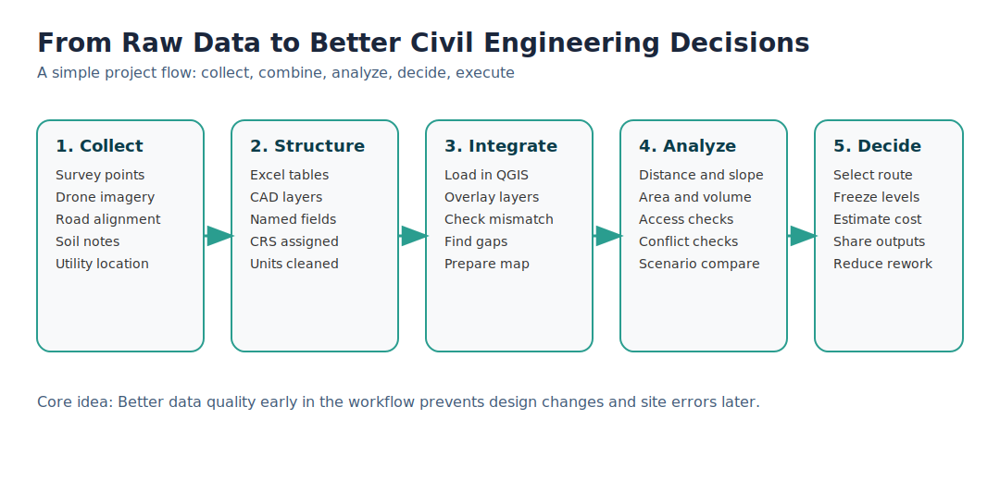
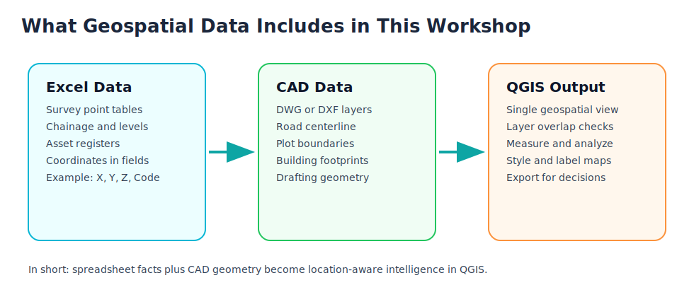
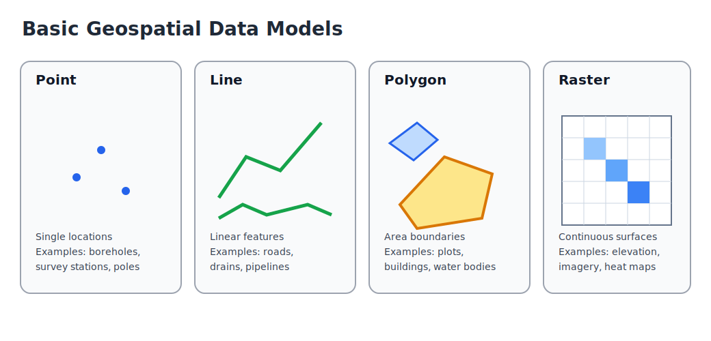

# Core Concepts and Standards

This page explains the core ideas in plain language and sets practical standards for day-to-day civil engineering work.

## A Simple Story First

Imagine a small team planning an approach road to a new site.

- The surveyor sends a spreadsheet with point coordinates and levels.
- The CAD drafter sends a drawing with centerline and plot boundaries.
- The project engineer must answer simple but critical questions:
  - Where exactly is the road alignment on ground?
  - How far is it from nearby structures?
  - Which option is safer and cheaper?

That is where data becomes geospatial data, and geospatial data becomes decisions.

## Data: Why It Matters in Civil Engineering

In civil engineering, data is not just documentation. It directly drives design quality, cost accuracy, and execution speed.

Common tasks that depend on good data:

- Site feasibility and constraints mapping.
- Alignment and grading decisions.
- Quantity and cost estimation.
- Clash and access checks before site execution.
- Progress tracking and as-built validation.

When data quality is weak, teams spend time rechecking drawings, repeating measurements, and correcting site mistakes.

## Geospatial Data: What It Is and Why It Is Different

Geospatial data is any data tied to location on Earth.

It usually answers one more question than normal data: where?

### How Is Geospatial Data Different?

| Normal data                         | Geospatial data                                           |
| ----------------------------------- | --------------------------------------------------------- |
| Has values only                     | Has values plus location                                  |
| Example: chainage table in Excel    | Example: chainage table with coordinates and map position |
| Hard to visualize spatial conflicts | Easy to overlay and inspect conflicts on map              |
| Mostly used for reporting           | Used for both reporting and spatial decision-making       |

### GIS: The Bridge Between Data and Location

GIS (Geographic Information System) is the software that helps us work with geospatial data. It allows us to:

- Import and visualize data on a map.
- Analyze spatial relationships and patterns.
- Export data in formats that can be shared and used in other tools.

### What Does It Include in This Workflow?

- Excel contributes attributes and coordinates (for example X, Y, Z, code, description).
- CAD contributes engineering geometry (lines, boundaries, layers, layout context).
- QGIS (An open-source GIS) combines both in one spatial workspace for validation, analysis, and outputs.

## Role of GIS in Civil Engineering

GIS is the bridge between raw project files and real-world engineering decisions.

GIS helps teams:

- See all project layers in one common location context.
- Verify if survey, CAD, and basemap data align correctly.
- Measure distance, area, slope, and proximity quickly.
- Compare alternatives before freezing design.
- Communicate decisions using clear maps and data-backed outputs.

In short, GIS reduces guesswork and rework.

## Data Models and Their Basic Types

Geospatial data is mainly represented in two models: vector and raster.

### Vector Model

Vector stores geometry as coordinates. It is best for precise engineering features.

- Point: one location (example: survey station, borehole).
- Line: linear feature (example: road centerline, drain, pipeline).
- Polygon: closed area (example: plot boundary, building footprint, pond).

### Raster Model

Raster stores data in a grid of cells. It is best for continuous surfaces.

- Typical uses: satellite imagery, DEM, slope, heat maps.
- Precision depends on pixel size.

Practical rule:

- Use vector for design geometry, assets, and reporting layers.
- Use raster for terrain, imagery, and surface-based analysis.

## Coordinate Reference System (CRS)

CRS is a rule set that tells software how coordinates relate to real-world locations.

Without a correct CRS, even good survey and CAD data can appear in the wrong place.

### Key CRS Used in This Reference

- WGS 84 (EPSG:4326): latitude and longitude on the Earth in degrees.
- WGS 84 / Pseudo-Mercator (EPSG:3857): standard projected system for web maps like Google Maps and OpenStreetMap.
- WGS 84 / UTM Zone 43N (EPSG:32643): projected CRS suited for metric engineering work in the target region.

### Practical Rule

- Use EPSG:4326 for KML and broad data exchange.
- Use EPSG:3857 only for web background viewing.
- Use UTM (for example EPSG:32643) for distance, area, and slope analysis in engineering tasks.

## File Formats and Their Roles

### Common Formats in Daily Civil GIS Workflows

| Format     | Data type             | Typical role in workflow                            |
| ---------- | --------------------- | --------------------------------------------------- |
| CSV        | Tabular               | Survey points, schedules, coordinate tables         |
| GeoTIFF    | Raster                | Basemap, DEM, orthophoto, terrain surfaces          |
| Shapefile  | Vector                | Legacy-compatible exchange of points/lines/polygons |
| GeoPackage | Vector and Raster     | Preferred single-file working format in GIS         |
| KML / KMZ  | Vector with styling   | Earth-browser sharing and quick review              |
| DWG / DXF  | CAD geometry and text | Drafting/design source and CAD-GIS exchange         |

Recommendation:

- Use GeoPackage as the main editable GIS format when possible.
- Export Shapefile, KML, or DXF only when external compatibility requires it.

### KML vs KMZ

| Format | What it is                         | Best use                                  | Notes                             |
| ------ | ---------------------------------- | ----------------------------------------- | --------------------------------- |
| KML    | Text-based Keyhole Markup Language | Sharing map features and simple styling   | Readable, editable, can be larger |
| KMZ    | Compressed KML package             | Sharing KML with icons/images in one file | Smaller size, easier to transfer  |

Rule of thumb:

- Use KML during editing or when you need readable text.
- Use KMZ for compact sharing and email transfer.

### DWG vs DXF

| Format | What it is                    | Best use                                  | Notes                               |
| ------ | ----------------------------- | ----------------------------------------- | ----------------------------------- |
| DWG    | Native AutoCAD drawing format | Active drafting and production drawings   | Richest CAD feature support         |
| DXF    | Drawing exchange format       | Interoperability with GIS and other tools | Better for data exchange, more open |

Rule of thumb:

- Use DWG as design source in CAD workflows.
- Use DXF when exchanging geometry across platforms, including GIS.

## Data Products and Derived Products

In civil engineering mapping workflows, some outputs are base products, and some are derived from analysis.

### Base Data Products

| Product | What it gives you                                | Common source                    |
| ------- | ------------------------------------------------ | -------------------------------- |
| Basemap | Ground context and visual reference for planning | Web tiles or orthophoto          |
| DEM     | Elevation surface where each cell stores height  | Survey/drone/LiDAR/raster source |

### Derived Products (Generated from Base Data)

| Product           | Derived from        | Why it is used in civil work                             |
| ----------------- | ------------------- | -------------------------------------------------------- |
| Contours          | DEM                 | Understand terrain form and grading intent               |
| Slope map         | DEM                 | Identify steep zones and feasibility/risk                |
| Elevation profile | DEM + selected line | Check rise/fall along road, drain, or pipeline alignment |
| Slope profile     | Elevation profile   | Quantify gradient changes and design comfort/safety      |

Simple interpretation flow:

- Basemap helps you see where features are.
- DEM helps you know how high or low the ground is.
- Contours and slope map help you understand terrain behavior.
- Elevation and slope profiles help you validate alignment decisions.

## Minimum Standards for Reliable Exchange

- Always assign and verify CRS before analysis.
- Keep units explicit in field names (for example Elev_m, Length_m).
- Use clear, stable layer naming conventions.
- Keep one source-of-truth file for each dataset.
- Validate geometry and attributes before export.

### Recommended CRS usage in civil engineering workflows:

- Always use a projected CRS (for example UTM 43N) for engineering analysis to ensure accurate distance and area measurements.
- Use geographic CRS (for example WGS 84) only for data exchange and when working with global datasets that require latitude and longitude.
- Be consistent with CRS across all project files to avoid misalignment and errors in analysis.
