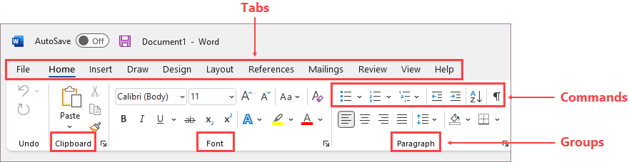
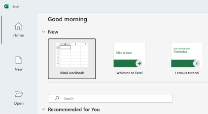
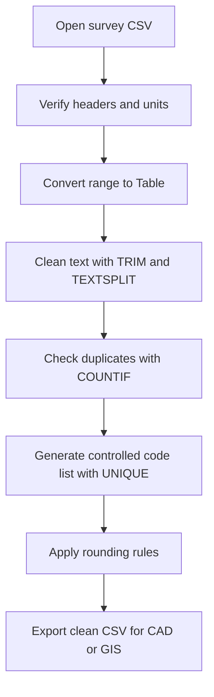
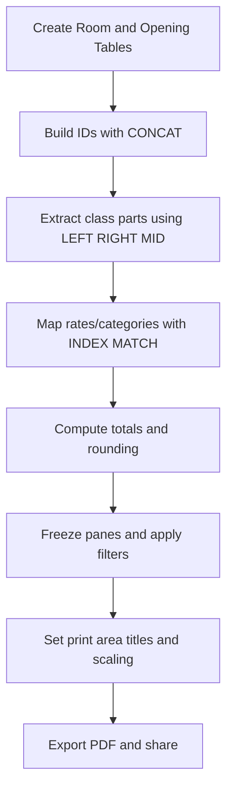
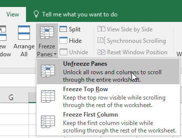

# Excel 365 Reference

This page explains high-impact Excel 365 workflows for engineering data preparation, validation, and reporting.

This reference is intentionally basic-level. It focuses on day-to-day CSV cleanup, schedule preparation, and print-ready outputs for CAD/GIS projects.

## What This Page Covers

- Interface overview.
- Must-know basics to get started.
- Must-know basic settings for reliable engineering sheets.
- High-impact formula and feature cards with examples.
- Simple practical workflows for survey and schedule use cases.

## What Excel Is

Excel is a spreadsheet tool used for calculation, tabular data management, validation, and reporting.
It is the fastest way to clean and verify survey or quantity data before CAD or GIS use.

Typical use cases:

- Room and opening schedules.
- Survey point checks.
- Quantity calculations.
- Lookup and data standardization.

In this training context, the highest-value capabilities are Table formatting, text cleanup, lookup functions, duplicate checks, Freeze Panes, and Page Setup.

## Overview of the Interface

The interface elements below are the most useful for beginner spreadsheet operations in engineering workflows:

1. Quick Access Toolbar: one-click Save, Undo, Redo for fast repetitive work.
2. Ribbon Tabs: Home, Insert, Formulas, Data, View, Page Layout are used most often.
3. Formula Bar: read and edit formulas safely before applying across rows.
4. Name Box: confirms active cell reference and helps fast navigation.
5. Worksheet Grid: core working area for records and fields.
6. Sheet Tabs: separate raw input, cleaned data, lookups, and output sheets.
7. Status Bar and Zoom: quick SUM/COUNT checks and zoom control for review.

## Must-Know Basics to Get Started

1. Start with a clean workbook and immediately save it in the project folder.
2. Keep one record per row and one field per column.
3. Add clear headers in row 1 with explicit units, for example Elevation_m.
4. Convert your range to a table early (Ctrl+T) so filters and structured references are available.
5. Keep raw input and processed output in separate sheets.
6. Use consistent data types in each column, numbers as numbers and text as text.
7. Freeze the header row before long-table review.
8. Use Find and Replace for controlled naming standardization.
9. Avoid merged cells in data sheets.
10. Test formulas on a few rows, then fill down.

## Must-Know Basic Configuration

| Setting area        | Workshop default                                              | Why it matters                                          |
| ------------------- | ------------------------------------------------------------- | ------------------------------------------------------- |
| Calculation mode    | Automatic (`Formulas > Calculation Options`)                  | Ensures totals update immediately after edits           |
| Regional separators | Keep decimal and thousands separators consistent across team  | Prevents numeric parsing errors after CSV import/export |
| Number formats      | Use explicit formats for coordinates, elevation, quantities   | Avoids hidden rounding and mixed-type issues            |
| Table setup         | Convert working range to Table (`Ctrl+T`) and name it clearly | Enables stable filters and readable formulas            |
| Freeze panes        | Freeze Top Row for long datasets (`View > Freeze Panes`)      | Keeps headers visible during validation                 |
| Page setup          | A4, correct orientation, margins, and scaling (`Page Layout`) | Produces readable print/PDF outputs                     |
| Print titles        | Repeat header row on each page (`Page Layout > Print Titles`) | Prevents unreadable multi-page reports                  |
| File versioning     | Save in OneDrive-synced project folder                        | Supports rollback and collaboration                     |

## Core Concepts in Simple Terms

- Row: one record.
- Column: one field.
- Cell: intersection of row and column.
- Formula: rule that calculates a value.
- Table: structured range with filter and sort controls.

## High-Impact Formula and Feature Cards

| Formula or feature                           | Purpose                                               | Usage example                                          | Practical tip                                            | Must-know options                           | Common mistake                                           |
| -------------------------------------------- | ----------------------------------------------------- | ------------------------------------------------------ | -------------------------------------------------------- | ------------------------------------------- | -------------------------------------------------------- |
| Basic math (`+`, `-`, `*`, `/`, `^`, `SQRT`) | Calculate totals, differences, and derived quantities | `=C2*D2` for area, `=SQRT(E2)` for checks              | Keep formula columns separate from raw input columns     | Use absolute refs like `$H$2` for constants | Mixing units (mm and m) in same calculation              |
| `ROUND`                                      | Standard decimal control                              | `=ROUND(E2,2)`                                         | Round only final output columns, not source measurements | Second argument is digits                   | Rounding too early and accumulating error                |
| `MROUND`                                     | Round to nearest step value                           | `=MROUND(E2,0.05)`                                     | Use for standard increments, such as 0.05 m              | Step value must match reporting rule        | Using wrong step size for project standard               |
| `CEILING`                                    | Round up to a step                                    | `=CEILING(E2,0.1)`                                     | Use for conservative upper estimates                     | Prefer `CEILING`/`CEILING.MATH` in 365      | Using it when nearest rounding is expected               |
| `FLOOR`                                      | Round down to a step                                  | `=FLOOR(E2,0.1)`                                       | Use for conservative lower estimates                     | Step must be positive and explicit          | Applying floor to values that must not be underestimated |
| `INDEX` + `MATCH`                            | Lookup from flexible columns                          | `=INDEX(RateTbl[Rate],MATCH([@Type],RateTbl[Type],0))` | More robust than fixed-column lookups                    | `MATCH(...,0)` for exact match              | Omitting exact match and returning wrong row             |
| `CONCAT`                                     | Join text fields                                      | `=CONCAT([@Block],"-",[@RoomNo])`                      | Build stable IDs for CAD/GIS labels                      | Combine with `TRIM` before concat           | Joining dirty text with hidden spaces                    |
| `TRIM`                                       | Remove extra spaces in text                           | `=TRIM(A2)`                                            | Use immediately after CSV import for code/name columns   | Apply to lookup keys first                  | Assuming visual spaces are the only spaces               |
| `LEFT`                                       | Extract leading characters                            | `=LEFT([@PointID],3)`                                  | Useful for zone/type prefixes                            | Second argument controls length             | Using fixed length when source format varies             |
| `RIGHT`                                      | Extract trailing characters                           | `=RIGHT([@PointID],2)`                                 | Useful for suffix-based grouping                         | Validate suffix length first                | Pulling wrong characters after inconsistent IDs          |
| `MID`                                        | Extract middle portion by position                    | `=MID([@PointID],4,3)`                                 | Use when IDs have stable pattern                         | Start position is 1-based                   | Off-by-one start index                                   |
| `TEXTSPLIT`                                  | Split composite text into fields                      | `=TEXTSPLIT(A2,"_")`                                   | Ideal for imported IDs such as `BLK01_ROOM02_W1`         | Delimiter can be one or multiple characters | Using wrong delimiter and shifting columns               |
| `COUNTIF` for duplicates                     | Identify duplicate IDs/codes                          | `=COUNTIF(A:A,A2)>1`                                   | Add a helper flag column and filter TRUE values          | Use exact same normalized key column        | Checking duplicates before text cleanup                  |
| `UNIQUE`                                     | Extract unique values                                 | `=UNIQUE(Table1[Code])`                                | Build controlled code lists for validation               | Works as dynamic spill range in 365         | Overwriting spill area with manual values                |
| Find and Replace                             | Bulk text standardization                             | Replace `rm` with `Room` in code column                | Scope replace to selected column when needed             | Match case and whole cell options           | Replacing globally without preview                       |
| Convert Range to Table                       | Enable sorting, filtering, and structured refs        | Select range then `Ctrl+T`                             | Name your table, such as `SurveyTbl`                     | Confirm header row checkbox                 | Leaving blank rows inside table                          |
| Freeze Panes                                 | Keep headers visible while scrolling                  | `View > Freeze Panes > Freeze Top Row`                 | Always freeze before validation review                   | Freeze based on active cell position        | Freezing wrong row/column due to cursor location         |
| Page Setup options                           | Prepare print/PDF output                              | `Page Layout > Size/Orientation/Margins/Scale`         | Check preview before export                              | Print Area, Print Titles, Fit to Page       | Printing full sheet with helper columns                  |

## Step-by-Step Practical Workflows

### Workflow A: Survey CSV to Clean Engineering Table

1. Open CSV and verify delimiter, decimals, and column names.
2. Convert to Table and rename it, for example `SurveyTbl`.
3. Standardize `PointID` and `Code` with `TRIM` and `TEXTSPLIT` where needed.
4. Add duplicate flag using `COUNTIF` and resolve duplicates before further processing.
5. Build a unique code list using `UNIQUE` for QA.
6. Apply `ROUND` or `MROUND` in final output columns only.
7. Save clean output to CSV for downstream CAD/GIS use.

### Workflow B: Room and Opening Schedule to Print-Ready Report

1. Create room and opening schedules as separate tables.
2. Use `CONCAT` to generate readable IDs, for example `BLK1-RM-101`.
3. Use `LEFT`, `RIGHT`, and `MID` to derive code segments where required.
4. Use `INDEX` + `MATCH` for category/rate mapping from a lookup table.
5. Calculate quantities, then apply `CEILING`/`FLOOR`/`ROUND` based on reporting rule.
6. Freeze top row and filter key fields for review.
7. Set print area, orientation, margins, and fit options before PDF export.

Freeze Panes example (Microsoft Support):

## Must-Know Tool Paths

- Convert range to table: `Insert > Table` or `Ctrl+T`
- Filter and sort: `Data > Filter` and column dropdowns
- Duplicate check helper: formula column using `COUNTIF`
- Unique list: formula using `UNIQUE`
- Text cleanup: formulas `TRIM`, `TEXTSPLIT`, `LEFT`, `RIGHT`, `MID`, `CONCAT`
- Lookup mapping: formulas `INDEX` and `MATCH`
- Freeze panes: `View > Freeze Panes`
- Print area and scaling: `Page Layout > Print Area`, `Scale to Fit`, `Print Titles`
- Final preview and PDF: `File > Print`

## Critical QA Checks

- Header names are clear and unit-aware, such as `Easting_m` and `Elevation_m`.
- No blank mandatory fields remain in key columns.
- Duplicate IDs are resolved before export.
- Lookup outputs are validated on sample rows.
- Rounding rule used in formulas matches reporting requirement.
- Freeze Panes is active for review sheets.
- Print preview is checked before sharing PDF.

## References and Image Sources

- [Microsoft Support: Customize the ribbon in Office](https://support.microsoft.com/en-us/office/customize-the-ribbon-in-office-00f24ca7-6021-48d3-9514-a31a460ecb31)
- [Microsoft Support: What is Excel?](https://support.microsoft.com/en-us/office/what-is-excel-94b00f50-5896-479c-b0c5-ff74603b35a3)
- [Microsoft Support: Freeze panes to lock rows and columns](https://support.microsoft.com/en-us/office/freeze-panes-to-lock-rows-and-columns-dab2ffc9-020d-4026-8121-67dd25f2508f)
- [Microsoft Support: Excel functions (alphabetical)](https://support.microsoft.com/en-us/office/excel-functions-alphabetical-b3944572-255d-4efb-bb96-c6d90033e188)

## Related Pages

- [Core Concepts and Standards](concepts-and-standards.md)
- [QGIS Reference](qgis-gep-reference.md)
- [Google Earth Pro Reference](google-earth-pro-reference.md)
- [AutoCAD Civil 3D Reference](autocad-civil3d-reference.md)
- [Interoperability Workflow](interoperability-workflow.md)
