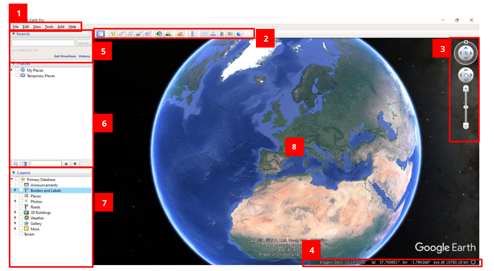
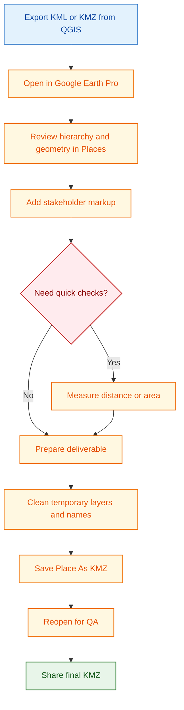

# Google Earth Pro Reference

This page is dedicated to Google Earth Pro for communication-focused visualization.

Use this tool for stakeholder-friendly viewing, not for precision engineering analysis.

## What This Page Covers

- Overview of the Google Earth Pro interface.
- Must-know basics to get started quickly.
- Must-know basic configuration for this workshop.
- Practical workflows for KML/KMZ review, markup, measurement, and sharing.
- Quality checks before publishing deliverables.

## Where Google Earth Pro Fits

Best use cases:

- Quick visual communication of project location and extent.
- Reviewing KML/KMZ deliverables with non-GIS users.
- Simple path and point inspection on a globe background.

Not recommended for:

- Accurate engineering measurements.
- Detailed slope and terrain analysis.
- Production-grade spatial editing.

## Overview of the Interface

From the CartONG Google Earth Pro tutorial, these are the high-impact interface areas for daily project communication:

The figure below maps major interface areas to daily training tasks.

1. Menu bar: access file operations, view settings, and tools.
2. Toolbar: quick access to common functions like placemarks and paths.
3. Navigation controls: pan, zoom, rotate, tilt, and reset view consistently.
4. Status bar: check coordinates and terrain/elevation context during review.
5. Search panel: quickly fly to a location by place name or coordinates.
6. Places panel: store, group, and revisit project placemarks, paths, and folders.
7. Layers panel: turn context layers on or off for clean stakeholder views.
8. 3D Viewer: inspect AOI and design context in an intuitive globe view.

## Navigation Recovery Shortcut

When you are lost in the 3D view, fix both orientation and tilt immediately:

- Press `R` to reset to north-up and no-tilt/top view.
- `R` is faster than pressing `N` and `U` separately.

## Must-Know Basics to Get Started

1. Open Google Earth Pro and confirm your project folder structure in Places.
2. Import KML or KMZ from QGIS and verify it appears in Temporary Places.
3. Move reviewed layers into clear folders under My Places.
4. Use keyboard `R` to reset to north-up and no-tilt view before screenshots or sharing.
5. Save reviewed outputs as KMZ packages when sharing with teams.

## Must-Know Basic Configuration (Workshop Defaults)

Set these as mandatory defaults before review sessions:

| Setting area         | Workshop default                                       | Why it matters                                           |
| -------------------- | ------------------------------------------------------ | -------------------------------------------------------- |
| Show Lat/Long        | UTM                                                    | Aligns with project measurement and reporting workflows  |
| Units of Measurement | Meters, Kilometers                                     | Maintains consistency with engineering communication     |
| Navigation behavior  | Do not automatically tilt while zooming                | Prevents accidental perspective distortion during review |
| Terrain              | Keep enabled when slope/elevation context is discussed | Avoids misreading flat vs terrain-informed context       |
| Places organization  | AOI-based folders with version/date naming             | Keeps deliverables auditable and easy to share           |

Quick validation before starting:

- Coordinates display is set to UTM.
- Measurement units are set to meters/kilometers.
- Auto-tilt on zoom is disabled.
- Keyboard `R` reset is working for north-up and no-tilt view.

## Practical Workflows

## Workflow A: Review, Markup, and Package QGIS Exports

1. Export final communication layers from QGIS as KML or KMZ.
2. Open KML or KMZ in Google Earth Pro.
3. Verify names, hierarchy, and visibility ranges of layers.
4. Add placemarks, paths, or polygons for stakeholder context.
5. Clean temporary layers and validate naming/version tags.
6. Save Place As KMZ.
7. Reopen once for QA, then share.

Output: reviewed KMZ package with stakeholder-ready layer organization.

## Workflow B: Measurement Checks (Distance, Area, Elevation Profile)

1. Open Tools > Ruler.
2. Select the measurement mode (line/path/polygon) based on need.
3. Confirm units are meters or kilometers.
4. Measure required distances/areas for quick communication checks.
5. Save measurements into Places for traceability.
6. For path-based checks, use elevation profile only for quick communication-level context.
7. For detailed engineering profile decisions, use QGIS profile workflow with the correct DEM source (Copernicus 30m for preliminary or survey-derived DEM for detailed analysis).

Output: saved communication-level measurement artifacts; detailed profile validation remains in QGIS workflows.

## Data Exchange Notes

- Prefer EPSG:4326-based outputs for KML workflows.
- Keep symbols simple because advanced cartographic styling may not transfer.
- Use KMZ when you need compact sharing or bundled resources.

## Must-Know Tool Paths

- Import KML/KMZ: File > Open.
- Save folder/package: Right-click folder > Save Place As.
- Create placemark: Add > Placemark.
- Create path/polygon: Add > Path or Add > Polygon.
- Ruler: Tools > Ruler.
- Elevation profile for path: Edit > Show Elevation Profile.
- Options/Preferences: Tools > Options (or Google Earth > Preferences on macOS).
- Quick north-up and no-tilt reset: keyboard `R`.

## Quality Checklist Before Sharing

- File opens without missing resources.
- Layer names are human-readable.
- AOI and key features are clearly visible at practical zoom levels.
- Version/date is included in file name.
- `R` reset check is performed before final screenshots or demonstrations.

## References and Image Sources

- [CartONG Tutorial: Mapping Basics within Google Earth Pro (2022, EN)](https://cartong.pages.gitlab.cartong.org/learning-corner/assets/pdfs/toolbox9/6_2_1_Google_Earth/2022_Tutoriel_GoogleEarthPro_CartONG_EN.pdf)
- [Google Earth Help: Create and Manage Placemarks](https://support.google.com/earth/answer/148142)
- [Google Earth Help: Measure Distance and Elevation](https://support.google.com/earth/answer/148134)

Images on this page are sourced from the CartONG 2022 Google Earth Pro tutorial.

## Related Pages

- [QGIS Reference](qgis-gep-reference.md)
- [Core Concepts and Standards](concepts-and-standards.md)
- [Interoperability Workflow](interoperability-workflow.md)
- [Practical Execution Guide](practical-execution-guide.md)
