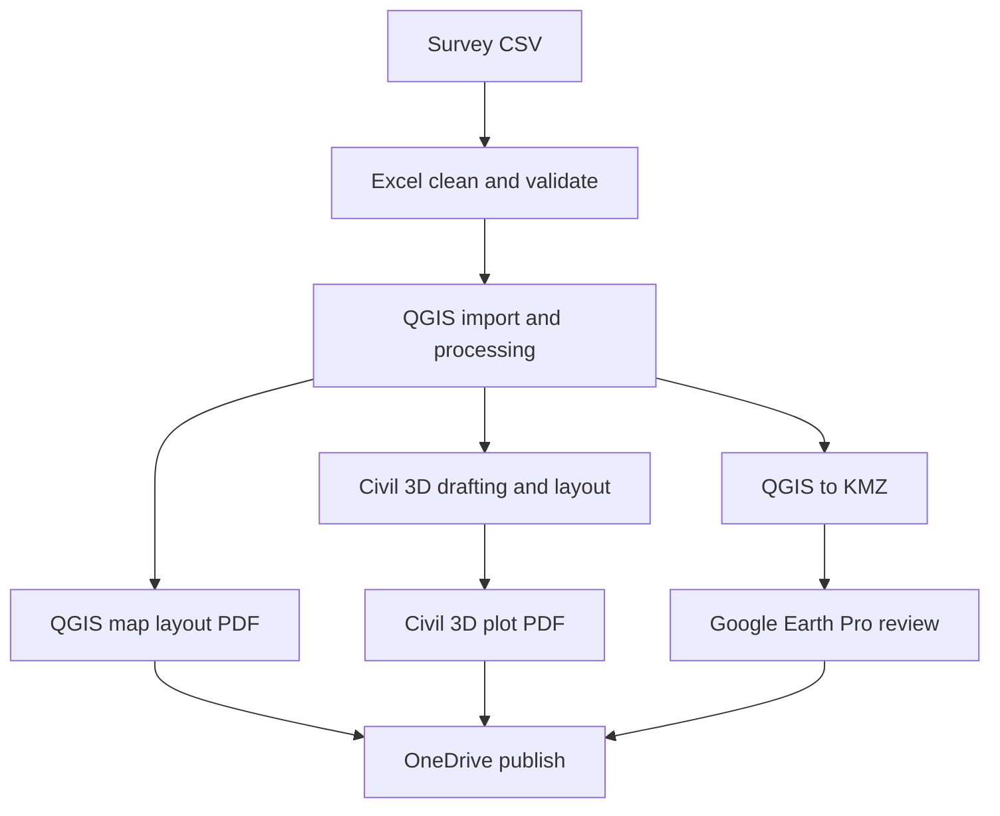

# Geo-CAD Practical Reference

	<h1>Simple, Practical, and Field-Focused</h1>
	
Learn high-impact CAD, spreadsheet, GIS, Earth-view, and collaboration workflows in one connected reference.

	
AutoCAD Civil 3D 2021 • Excel 365 • QGIS 3.40 • Google Earth Pro • OneDrive

This documentation is for beginner-to-intermediate users who need clear theory, practical execution, and reliable data handoff.

## Prerequisites

- AutoCAD Civil 3D 2021 installed.
- Excel 365 installed.
- QGIS 3.40 installed with required plugins.
- Google Earth Pro installed.
- OneDrive signed in and syncing.
- Internet available for basemap/DEM downloads.
- Starter dataset available from [Dataset Templates](dataset-templates.md).

## CRS Assumption for This Workshop

- Target training area assumes UTM Zone 43N (`EPSG:32643`).
- If your AOI is in a different zone, use the appropriate UTM zone for that AOI.
- Keep one projected CRS consistent across QGIS, Civil 3D, exports, and exchange files.

## What This Reference Covers

- Core concepts in plain language.
- Tool-specific beginner workflows.
- Interoperability and format decisions.
- Practical execution from raw survey data to final deliverables.
- Collaboration and version recovery with OneDrive.

## Reference Scope

- Building example: two-room, ground-floor plan.
- Site context: one simple approach road.
- Survey input: total station CSV points.
- GIS input: AOI, basemap, DEM, contours.

## End-to-End Data Flow

## Quick Start Path

1. Read [Core Concepts and Standards](concepts-and-standards.md).
2. Review [QGIS Reference](qgis-gep-reference.md), [AutoCAD Civil 3D Reference](autocad-civil3d-reference.md), [Excel 365 Reference](excel-365-reference.md), [Google Earth Pro Reference](google-earth-pro-reference.md), and [OneDrive Reference](onedrive-reference.md).
3. Download starter files from [Dataset Templates](dataset-templates.md).
4. Execute the full run in [Practical Execution Guide](practical-execution-guide.md).
5. Use [Cheatsheet](cheatsheet.md) while working and [Troubleshooting](troubleshooting.md) when outputs mismatch.

## Questions and Discussion

- Ask questions, share insights, and discuss solutions in the [Questions and Discussion](questions-discussion.md) section.

## Repository and Collaboration

- GitHub repository: [PrathamGitHub/Geo-CAD-Practical-Reference](https://github.com/PrathamGitHub/Geo-CAD-Practical-Reference)
- Use this repository for updates, issue tracking, and collaborative improvements.
- Open issues for corrections or enhancement suggestions.
- Use pull requests for content improvements and dataset updates.
