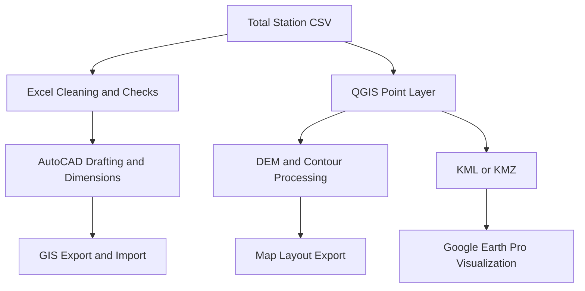

# Geo-CAD Practical Reference

	<h1>Simple, Practical, and Field-Focused</h1>
	
Learn high-impact CAD, spreadsheet, and GIS workflows in one connected reference.

	
AutoCAD Civil 3D 2021 • Excel 365 • QGIS 3.40 • Google Earth Pro • OneDrive

This documentation is written for beginner-to-intermediate users who need clear theory and practical execution steps.

## What This Reference Covers

- Plain-language definitions for key concepts.
- Context for when to use each tool.
- Practical, step-by-step workflows.
- Pros, cons, and recommendations.
- Common industry standards and format practices.
- Interoperability between CSV, CAD, GIS, and KML or KMZ.

## Reference Scope

- Building example: two-room, ground-floor plan.
- Site context: one simple approach road.
- Survey input: total station CSV points.
- GIS input: AOI, basemap, DEM, contours.

## End-to-End Data Flow

## Recommended Reading Path

1. Start with concepts and standards.
2. Learn each tool reference page.
3. Practice the integrated execution guide.
4. Use the cheatsheet while doing tasks.
5. Use troubleshooting when outputs mismatch.

## Repository and Collaboration

- GitHub repository: [PrathamGitHub/Geo-CAD-Practical-Reference](https://github.com/PrathamGitHub/Geo-CAD-Practical-Reference)
- Use this repository for updates, issue tracking, and collaborative improvements.
- Open issues for corrections or enhancement suggestions.
- Use pull requests for content improvements and dataset updates.

## Screenshot Placeholder

> Insert screenshot: final project output folder with CAD drawing, PDF, Excel workbook, GeoTIFF, contour layer, and KML file.

