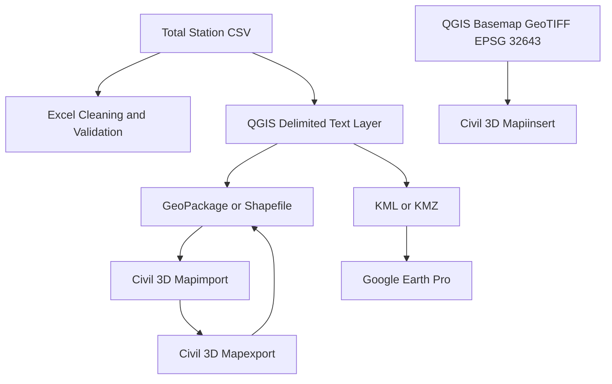
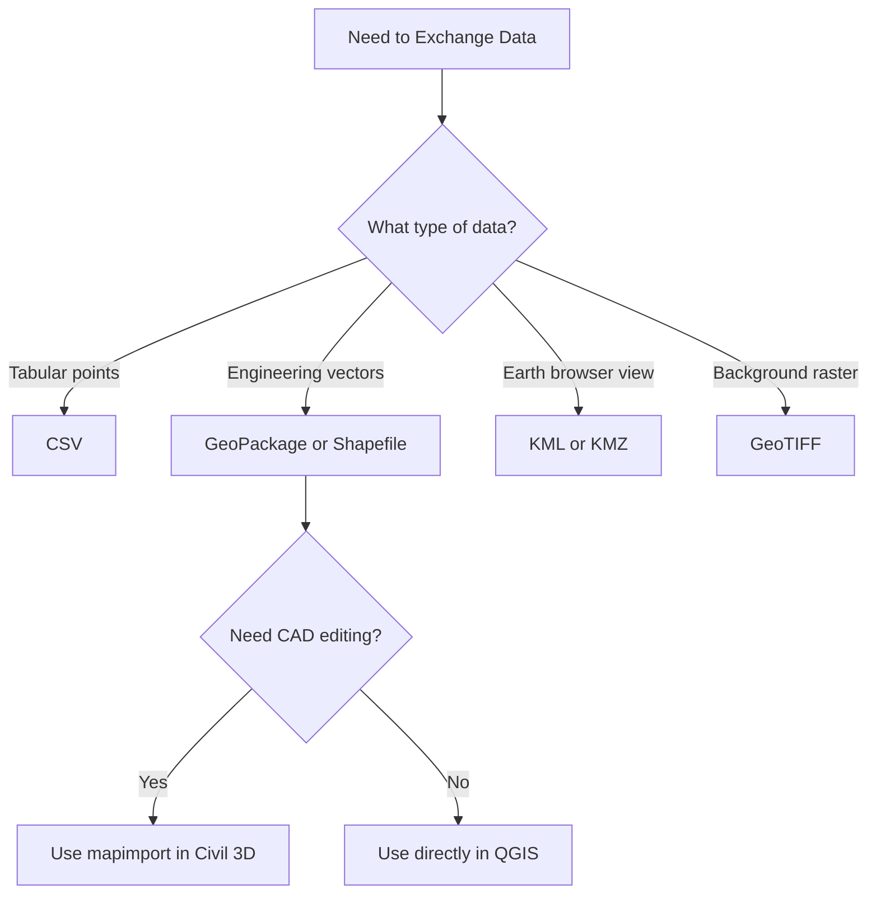

# Interoperability Workflow

This page explains how to move data safely between Excel, Civil 3D, QGIS, and Google Earth Pro.

## What Interoperability Means

Definition:
Interoperability means one dataset can be used in another tool without losing meaning, geometry, scale, or important attributes.

Context:
Engineering workflows often fail because files are exchanged without checking CRS, units, and field mappings.

## Why Interoperability Matters

Pros:

- Reduces duplicate work.
- Improves consistency across teams.
- Enables faster communication with mixed software users.

Cons:

- Wrong CRS can silently shift data.
- Some formats drop style or attribute types.
- Repeated conversion can degrade data quality.

Recommendation:
Treat one file as source of truth and publish derived exports for other tools.

## End-to-End Data Flow

## Decision Guide for Format Selection

## Practical Workflow

### Total Station CSV to Excel

1. Import CSV.
2. Verify PointID, Easting, Northing, Elevation, and Code fields.
3. Convert to table.
4. Clean duplicates and missing values.
5. Save a cleaned version.

### Total Station CSV to QGIS

1. Add delimited text layer.
2. Set X and Y fields.
3. Assign source CRS correctly.
4. Save as GeoPackage for editing stability.

### QGIS Basemap to Civil 3D

1. Download basemap in QGIS.
2. Reproject raster to EPSG:32643 with Warp GDAL.
3. Insert into Civil 3D with mapiinsert.
4. Verify alignment using known points.

### QGIS Vector to Civil 3D and Back

1. Export vector from QGIS to Shapefile or GeoPackage.
2. Import in Civil 3D using mapimport.
3. Edit and annotate as required.
4. Export GIS-ready vector using mapexport.
5. Validate in QGIS.

### KML or KMZ for Google Earth Pro

1. Export final communication layer from QGIS as KML or KMZ.
2. Open in Google Earth Pro.
3. Verify location, labels, and geometry.

## Industry Standards and Good Practice

- Keep CRS metadata explicit in every file handoff.
- Use OGC-friendly formats where possible.
- Keep unit fields explicit for elevation and distance.
- Maintain clear naming and version labels.
- Avoid unnecessary repeated format conversion.

## Screenshot Placeholders

> Insert screenshot: CSV imported as a point layer with correct CRS in QGIS.

> Insert screenshot: mapimport settings and imported geometry in Civil 3D.

> Insert screenshot: reprojected basemap inserted in Civil 3D using mapiinsert.

> Insert screenshot: KML or KMZ displayed in Google Earth Pro.

