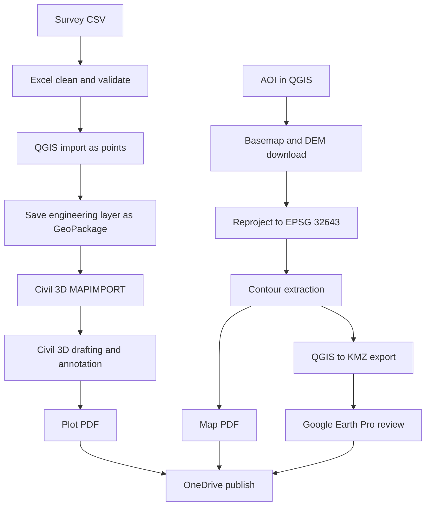
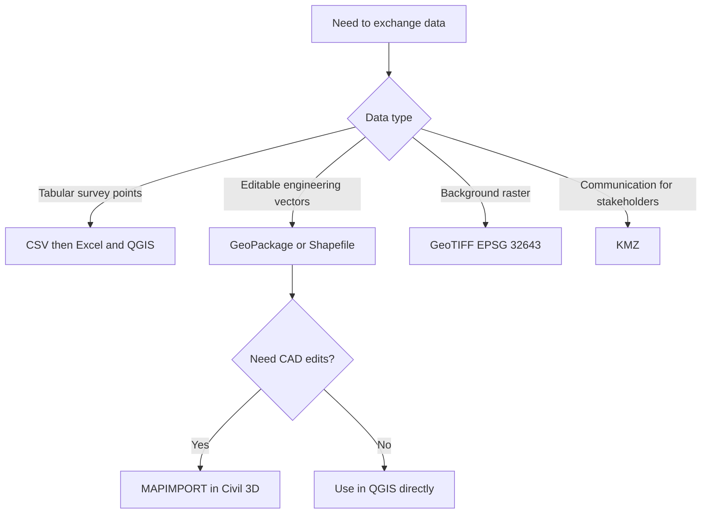
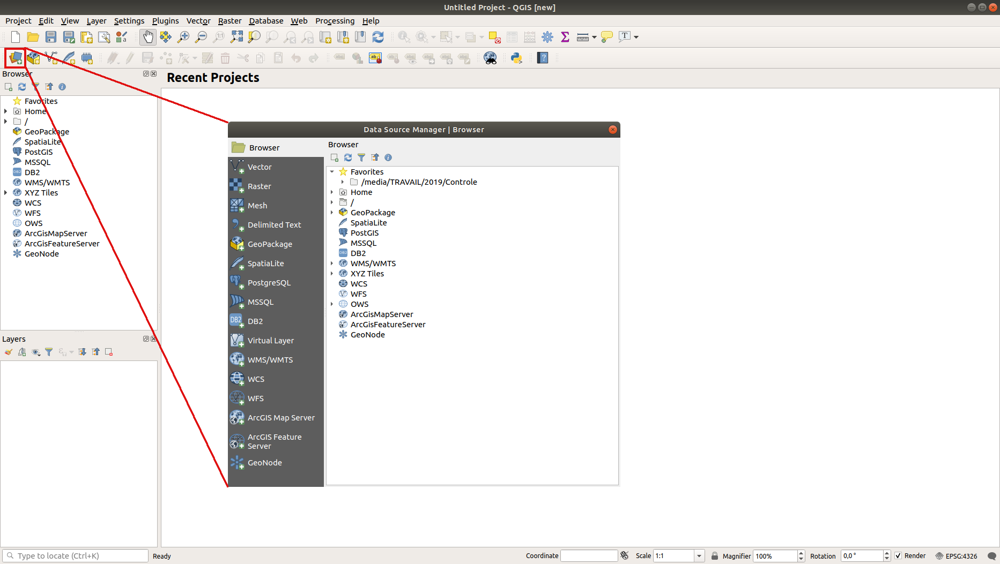
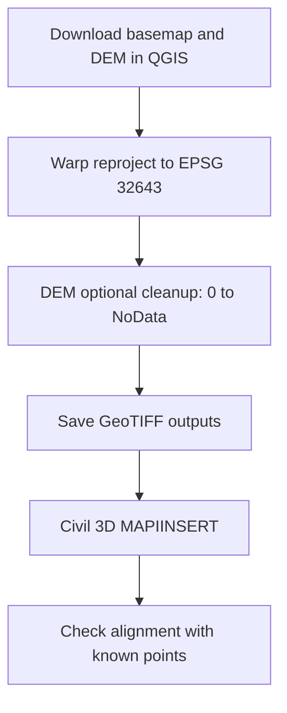
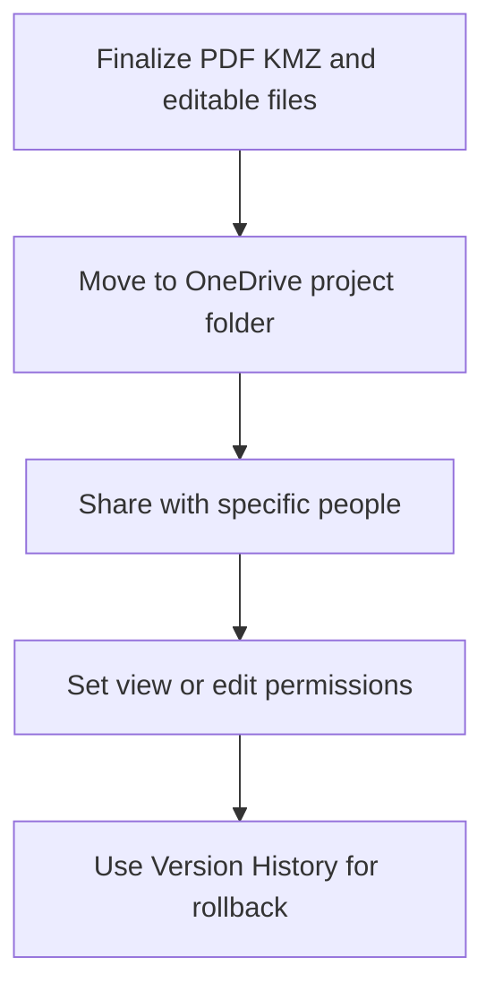

# Interoperability Workflow

This page explains the safest and simplest way to move data between Excel, Civil 3D, QGIS, Google Earth Pro, and OneDrive.

This is a beginner-first workflow focused on communication outputs (PDF and KMZ) while preserving editable exchange files.

## What This Page Covers

- End-to-end data handoff from survey CSV to communication outputs.
- Format decisions for vectors, rasters, and Earth-browser sharing.
- EPSG:32643 and units checks at every exchange point.
- Compact OneDrive publishing workflow for team collaboration.

## Workshop Defaults (Keep Fixed)

- Working projected CRS: `EPSG:32643`
- Distance and elevation units: meters
- Communication priority outputs: Plot PDF and KMZ
- Editable exchange outputs: GeoPackage/Shapefile and GeoTIFF

## Why Interoperability Fails

- CRS missing or wrong during import/export.
- Mixed units across tools.
- Attribute field names changed during conversion.
- Uncontrolled file naming and versioning.

Rule: treat one dataset as source-of-truth, then publish derived exports for other tools.

## End-to-End Data Flow

## Format Decision Guide

## Practical Handoff Workflows

### Workflow A: Survey CSV -> Excel -> QGIS Points

1. Import survey CSV in Excel and validate `PointID`, `Easting`, `Northing`, `Elevation`, `Code`.
2. Remove duplicates and apply naming consistency.
3. Save cleaned CSV as publish-ready input.
4. Add CSV in QGIS as Delimited Text layer (X/Easting, Y/Northing).
5. Assign correct source CRS and then save as GeoPackage.

Output: reliable point layer for GIS/CAD exchange.

### Workflow B: QGIS Vector <-> Civil 3D

1. Export vector from QGIS as GeoPackage or Shapefile.
2. In Civil 3D, set `MAPCSASSIGN` first to `UTM84-43N` (EPSG:32643 equivalent workshop target).
3. Import vector with `MAPIMPORT`.
4. Draft or annotate in Civil 3D.
5. Export GIS-ready layer using `MAPEXPORT`.
6. Validate geometry and attributes again in QGIS.

Output: CAD and GIS stay aligned without rework.

### Workflow C: QGIS Raster -> Civil 3D Background

1. Download basemap and DEM in QGIS.
2. Reproject both to `EPSG:32643`.
3. Optionally clean DEM zero pixels to NoData before contour generation.
4. Insert georeferenced raster in Civil 3D using `MAPIINSERT`.
5. Verify against known control locations.

Output: consistent background context in CAD and GIS.

### Workflow D: QGIS -> KMZ -> Google Earth Pro

1. Export final communication layer from QGIS as KMZ.
2. Open in Google Earth Pro.
3. Verify names, labels, and geometry.
4. Use `R` key to reset north-up/no-tilt before final screenshots.

Output: stakeholder-friendly visualization package.

### Workflow E: Publish and Collaborate in OneDrive

1. Publish final files in OneDrive project structure.
2. Share communication files as view links.
3. Share editable files only to required editors.
4. Use Version History after major edits.

Output: controlled collaboration and recovery-ready file trail.

## Minimum Handoff Checklist

- CRS is explicit and correct (`EPSG:32643`) in all GIS/CAD exports.
- Units are meters for distance/elevation.
- Critical IDs and attributes remain intact after conversion.
- Final PDF and KMZ open correctly in target tools.
- OneDrive permissions match intended audience.

## Related Pages

- [Excel 365 Reference](excel-365-reference.md)
- [AutoCAD Civil 3D Reference](autocad-civil3d-reference.md)
- [QGIS Reference](qgis-gep-reference.md)
- [Google Earth Pro Reference](google-earth-pro-reference.md)
- [OneDrive Reference](onedrive-reference.md)
- [Practical Execution Guide](practical-execution-guide.md)
