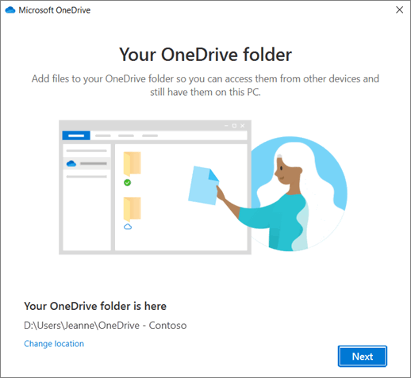
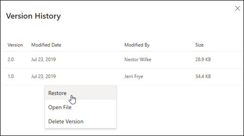
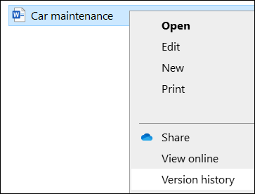
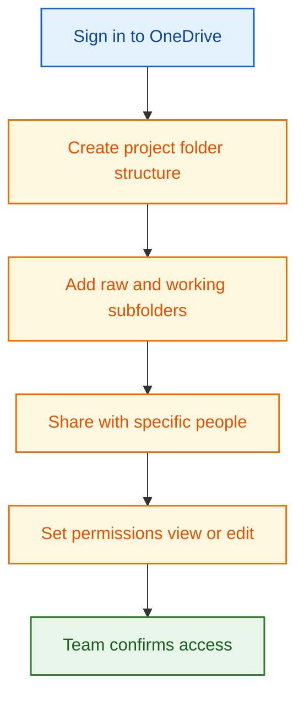
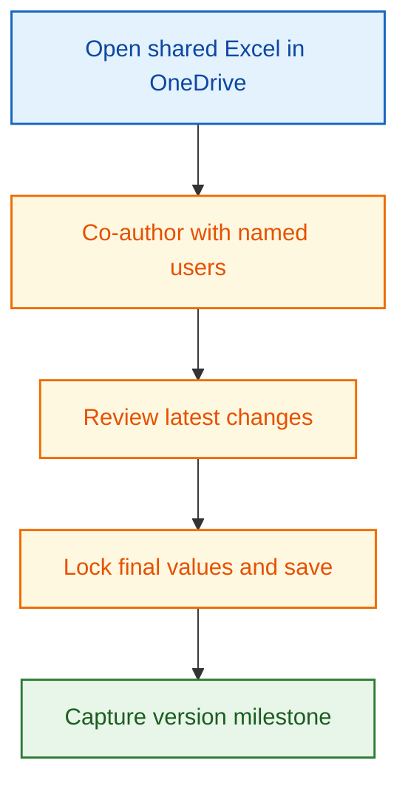
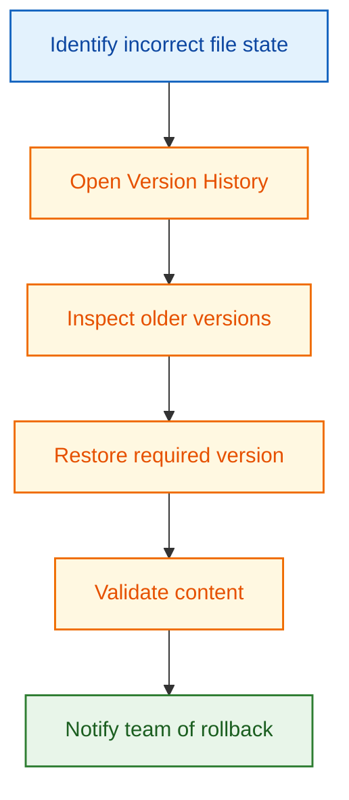
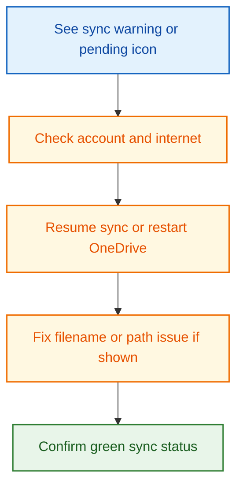

# OneDrive Reference

This page is a practical, minimal guide for OneDrive collaboration and file version tracking.

This reference is intentionally simple. It focuses on sharing, co-authoring, version history, and sync reliability for day-to-day project execution.

## What This Page Covers

- OneDrive interface overview for web and File Explorer use.
- Must-know basics to get started quickly.
- Must-know basic settings for stable collaboration.
- Practical workflows for sharing, co-authoring, restoring versions, and sync recovery.

## Where OneDrive Fits in This Handbook

Best use cases:

- Shared working folders for Excel sheets, CAD exports, and GIS deliverables.
- Fast team collaboration with controlled permissions.
- File-level version history and restore after mistakes.
- Offline work with automatic sync on reconnect.

Important scope note:

- OneDrive gives cloud sync plus file version history.
- It is not a branch-based distributed source control system like Git.

## Overview of the Interface

In this workshop, the most useful interface areas are the OneDrive sync app, File Explorer integration, and web version history panel.

1. OneDrive account and local folder setup: where synced project files will live on the computer.
2. File Explorer OneDrive folder: primary daily workspace for synced files.
3. Right-click context actions: share, view online, and version history.
4. Web file list and command bar: best place to manage sharing and access details.
5. Version History panel: restore earlier file states after accidental edits.
6. Sync status indicators: quickly detect pending, paused, or error states.

## Must-Know Basics to Get Started

1. Sign in to OneDrive with the correct account (personal or work/school).
2. Confirm the local OneDrive folder location during setup.
3. Create a project folder with clear naming and date/version discipline.
4. Keep raw inputs and reviewed outputs in separate subfolders.
5. Share folders with minimum required permissions.
6. Co-author only where needed and keep naming conventions stable.
7. Use Version History instead of creating many manual file copies.
8. Watch sync status icons before shutdown or file handoff.
9. For external sharing, use specific links and verify access from a test account.
10. Reopen critical shared files once after sync to confirm integrity.

## Must-Know Basic Configuration

| Setting area             | Workshop default                                                     | Why it matters                                       |
| ------------------------ | -------------------------------------------------------------------- | ---------------------------------------------------- |
| Account selection        | Use one primary account per project folder (personal or work/school) | Prevents cross-account confusion                     |
| OneDrive folder location | Keep default unless storage policy requires change                   | Avoids broken path references                        |
| Files On-Demand          | Enabled                                                              | Saves disk space while keeping full cloud visibility |
| Folder sync scope        | Sync only active project folders                                     | Improves sync speed and reduces conflict risk        |
| Link sharing mode        | Prefer Specific people for controlled sharing                        | Reduces accidental public exposure                   |
| Edit permission          | Disable edit unless collaboration is required                        | Protects approved deliverables                       |
| Sync startup             | Start OneDrive automatically with Windows                            | Prevents unsynced local-only edits                   |
| Version recovery habit   | Use Version History before overwrite/rollback                        | Preserves audit trail and reduces data loss          |

Quick check before team work:

- Correct account is signed in.
- Sync icon is healthy (not paused/error).
- Shared folder permissions are verified.

## Practical Workflows

### Workflow A: Project Folder Setup and Team Share

1. Sign in and confirm account type (personal or work/school).
2. Create a project root folder with standard subfolders.
3. Upload or move current workshop files to the correct subfolders.
4. Share using Specific people when possible.
5. Give edit rights only where collaboration is required.
6. Ask one collaborator to validate access.

Output: controlled shared workspace ready for execution.

### Workflow B: Co-Author Excel and Keep Changes Traceable

1. Open the shared Excel file from OneDrive.
2. Co-author for active updates, then pause edits for review.
3. Resolve naming and data consistency before final save.
4. Record milestone in file name or notes when needed.

Output: collaboratively updated sheet with clear ownership trail.

### Workflow C: Restore Previous File Version After Mistake

1. Right-click file (web or File Explorer) and open Version History.
2. Review timestamps and authors.
3. Restore the correct prior version.
4. Validate key values/content immediately.
5. Notify collaborators that a restore was applied.

Output: known-good version restored without manual reconstruction.

### Workflow D: Resolve Sync Issue Quickly

1. Check tray icon and file status.
2. Resume sync if paused.
3. If needed, restart OneDrive or re-open file after closing active editors.
4. Fix invalid filename/path cases and allow resync.
5. Confirm healthy status before sharing final outputs.

Output: sync restored and file state reliable across users.

## Must-Know Tool Paths

- OneDrive web: onedrive.live.com
- Share (web): select item > Share > Copy link or Specific people
- Manage access (web): select item > Details pane > Manage access
- Version history (web): right-click file > Version history
- Version history (File Explorer): right-click synced file > Version history
- Sync controls: taskbar cloud icon > Help and Settings

## Critical QA Checks

- Correct account is used for the target project folder.
- No sync warnings are active before handoff.
- Shared links have intended audience and permission level.
- External users can access only what was intended.
- Restored version is validated after rollback.

## References and Image Sources

- [Microsoft Support: Share files and folders in Microsoft OneDrive](https://support.microsoft.com/en-us/office/share-files-and-folders-in-microsoft-onedrive-9fcc2f7d-de0c-4cec-93b0-a82024800c07)
- [Microsoft Support: Sync your computer's files and folders with OneDrive](https://support.microsoft.com/en-us/office/sync-your-computer-s-files-and-folders-with-onedrive-615391c4-2bd3-4aae-a42a-858262e42a49)
- [Microsoft Support: Restore a previous version of a file stored in OneDrive](https://support.microsoft.com/en-us/office/restore-a-previous-version-of-a-file-stored-in-onedrive-159cad6d-d76e-4981-88ef-de6e96c93893)
- [Microsoft Support: Fix OneDrive sync problems](https://support.microsoft.com/en-us/office/fix-onedrive-sync-problems-0899b115-05f7-45ec-95b2-e4cc8c4670b2)

## Related Pages

- [Excel 365 Reference](excel-365-reference.md)
- [Interoperability Workflow](interoperability-workflow.md)
- [Practical Execution Guide](practical-execution-guide.md)
- [Troubleshooting](troubleshooting.md)
