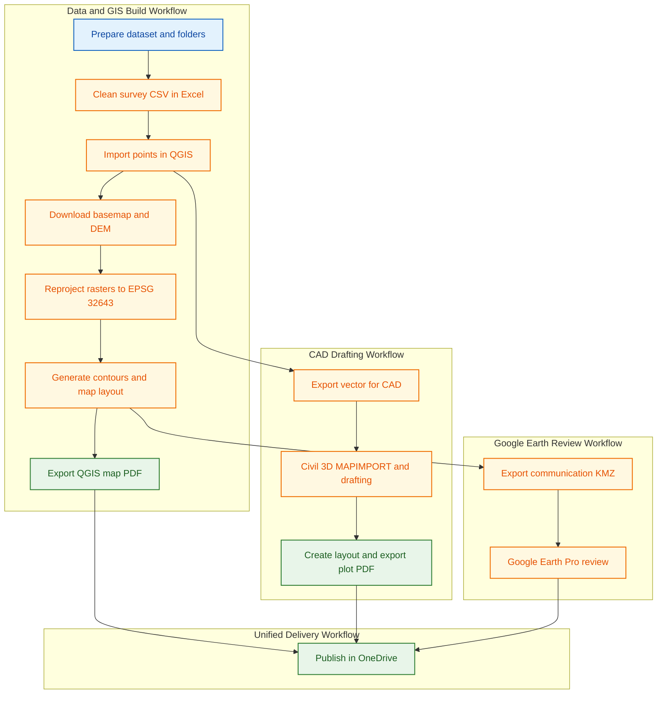
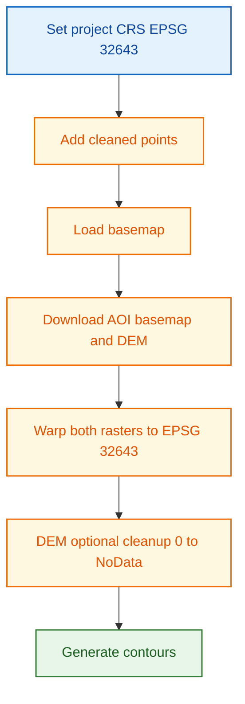
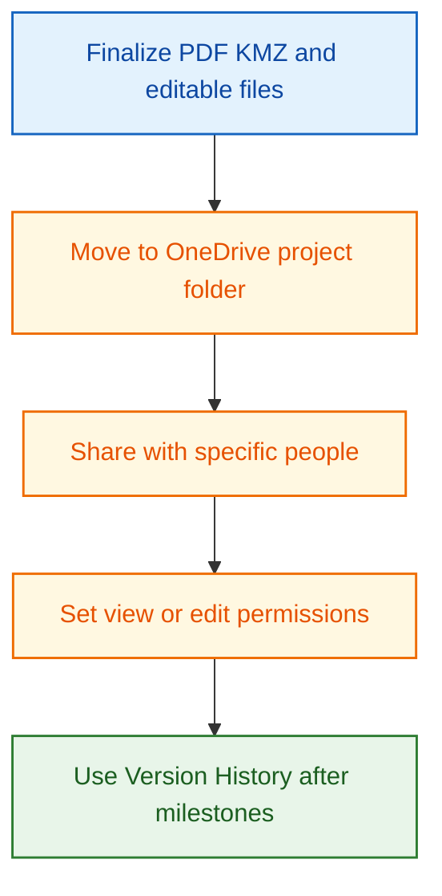

# Practical Execution Guide

This guide gives one connected beginner workflow from raw data to final communication outputs.

Primary priority: Plot PDF and KMZ communication outputs.

Secondary priority: editable exchange files for team rework.

## Project Scenario

Use a simple project:

- Two-room building, ground floor only.
- One short approach road.
- Total station points in CSV.
- AOI for basemap and DEM.

## Handbook Defaults (Do Not Change)

- Working projected CRS: `EPSG:32643`
- Units for distance/elevation: meters
- Final communication deliverables: PDF and KMZ

## Expected Outputs

### Primary Outputs

- Civil 3D plot PDF.
- QGIS map PDF.
- KMZ for Google Earth Pro.

### Supporting Editable Outputs

- Excel cleaned survey workbook/CSV.
- Reprojected basemap GeoTIFF (`EPSG:32643`).
- Reprojected DEM GeoTIFF (`EPSG:32643`).
- Contour vector layer (GeoPackage/Shapefile).
- CAD/GIS exchange layers.

## Workflow Overview

## Step 1: Prepare Project Folder

1. Create a project folder with subfolders: `01_raw`, `02_excel`, `03_qgis`, `04_civil3d`, `05_exports`.
2. Copy starter CSV and GeoJSON files into `01_raw`.
3. Keep raw files unchanged.
4. Store project root in your OneDrive synced location for version-safe work.

## Step 2: Clean Survey CSV in Excel

1. Open CSV and verify `PointID`, `Easting`, `Northing`, `Elevation`, `Code`.
2. Convert range to table.
3. Run text cleanup and duplicate checks.
4. Save cleaned survey file in `02_excel`.
5. Keep a `v1`, `v2` naming pattern for major changes.

## Step 3: Build Base GIS Layers in QGIS

1. Set QGIS project CRS to `EPSG:32643` before processing.
2. Import cleaned CSV as points.
3. Load basemap with QuickMapServices and download AOI raster if needed.
4. Download Copernicus DEM.
5. Reproject basemap and DEM with Warp to `EPSG:32643`.
6. Optionally set DEM zero values to NoData.
7. Extract contours using practical interval.

## Step 4: Draft and Plot in Civil 3D

1. Start drawing with layer discipline.
2. Assign `MAPCSASSIGN` to `UTM84-43N` (workshop CRS target).
3. Import required GIS vector using `MAPIMPORT`.
4. Draft two-room plan, wall thickness, and openings.
5. Add dimensions and annotations.
6. Build one layout and export plot PDF.

## Step 5: Prepare Communication Outputs

1. In QGIS, style contour and key layers for readability.
2. Build map layout (title, legend, north arrow, scale bar).
3. Export QGIS map PDF.
4. Export final communication layer to KMZ.
5. Open KMZ in Google Earth Pro and verify labels/geometry.

## Step 6: Compact Data Exchange Across Tools

1. QGIS point/vector -> Civil 3D via GeoPackage/Shapefile and `MAPIMPORT`.
2. QGIS raster -> Civil 3D via GeoTIFF and `MAPIINSERT`.
3. Civil 3D -> GIS via `MAPEXPORT`.
4. QGIS -> Google Earth Pro via KMZ.

## Step 7: Save and Share with OneDrive

1. Publish final files in OneDrive project folder.
2. Share PDF/KMZ as view-only by default.
3. Share editable files only to required editors.
4. Use Version History after major edits.
5. For detailed collaboration settings, use [OneDrive Reference](onedrive-reference.md).

## Daily Quick Check (Before Closing Work)

- Files saved in OneDrive synced folder.
- No active sync warnings.
- CRS remains `EPSG:32643` for all GIS/CAD exchange outputs.
- Latest PDF and KMZ open correctly.
- Major edits are version-labeled.

## Final Quality Checks

- Geometry is clean and readable.
- Units and CRS are consistent.
- Tables have no duplicate critical IDs.
- CAD, GIS, and Google Earth outputs align spatially.
- Communication deliverables (PDF + KMZ) are present and verified.

## Related Pages

- [Excel 365 Reference](excel-365-reference.md)
- [QGIS Reference](qgis-gep-reference.md)
- [AutoCAD Civil 3D Reference](autocad-civil3d-reference.md)
- [Google Earth Pro Reference](google-earth-pro-reference.md)
- [Interoperability Workflow](interoperability-workflow.md)
- [OneDrive Reference](onedrive-reference.md)
