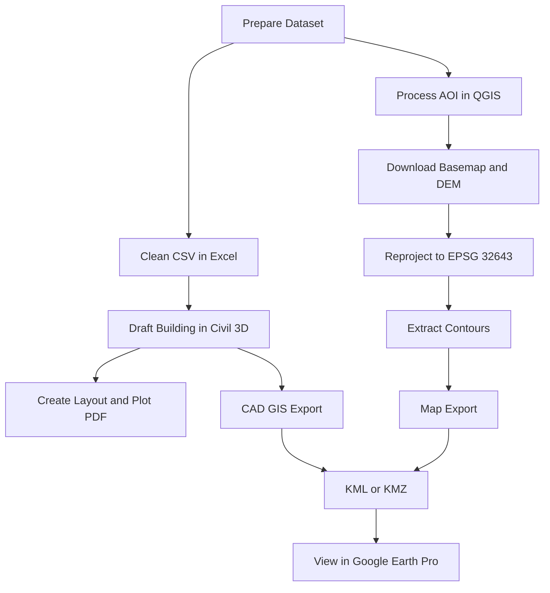

# Practical Execution Guide

This guide gives one connected workflow from raw data to final outputs.

## Project Scenario

Use a simple project:
- Two-room building, ground floor only.
- One short approach road.
- Total station points in CSV.
- AOI for basemap and DEM.

## Expected Outputs

- CAD drawing with dimensions and annotations.
- Plot PDF.
- Excel workbook with cleaned tables and formulas.
- Reprojected basemap GeoTIFF.
- Reprojected DEM GeoTIFF.
- Contour vector layer.
- KML or KMZ for Google Earth Pro.

## Workflow Overview

## Step 1: Prepare Dataset Folder

1. Create folders for CAD, Excel, GIS, and exports.
2. Copy starter CSV and GeoJSON files.
3. Keep original files unchanged as backup.

## Step 2: Process Survey CSV in Excel

1. Open CSV.
2. Verify PointID, Easting, Northing, Elevation, and Code columns.
3. Convert to table.
4. Remove obvious duplicates.
5. Create unique code list.
6. Save cleaned file.

## Step 3: Build CAD Drawing in Civil 3D

1. Start drawing with clear layer setup.
2. Draw two-room ground-floor plan with polyline.
3. Add wall thickness using offset.
4. Create door and window openings using trim and extend.
5. Create one simple section.
6. Create one simple elevation.
7. Add dimensions and annotations.
8. Create one layout and export PDF.

## Step 4: Prepare Basemap and DEM in QGIS

1. Set project CRS.
2. Load satellite map from QuickMapServices.
3. Download AOI basemap using Advanced Map Downloader.
4. Download Copernicus DEM from OpenTopography DEM Downloader.
5. Reproject both rasters to EPSG:32643 with Warp GDAL.

## Step 5: Generate Contours and Basic Map

1. Run GDAL Contour on reprojected DEM.
2. Select practical contour interval.
3. Style contours with readable labels.
4. Build map layout with title, legend, north arrow, and scale bar.
5. Export PDF.

## Step 6: Exchange Data Across Tools

1. Import cleaned CSV to QGIS as points.
2. Export selected layer to shapefile or GeoPackage.
3. Import vector into Civil 3D using mapimport.
4. Insert georeferenced raster in Civil 3D using mapiinsert.
5. Export CAD output for GIS using mapexport.
6. Convert final vector to KML or KMZ.
7. Open in Google Earth Pro.

## Step 7: Save and Share with OneDrive

1. Save project files to OneDrive synced folder.
2. Keep file names version-friendly.
3. Use version history after major edits.
4. Share read-only and edit links as required.

## Final Quality Checks

- Geometry is clean and readable.
- Units and CRS are consistent.
- Tables have no duplicate critical IDs.
- Map and CAD outputs align spatially.
- Final exports open in target tools.

## Screenshot Placeholders

> Insert screenshot: integrated project folder with all output files.

> Insert screenshot: final CAD plot and GIS map side by side.

