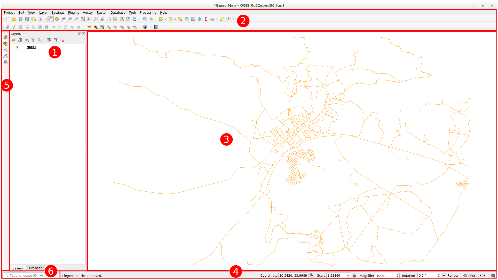
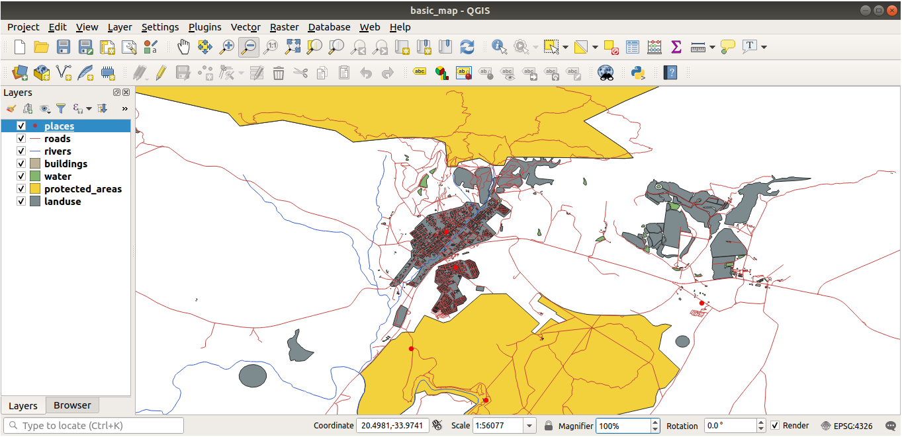
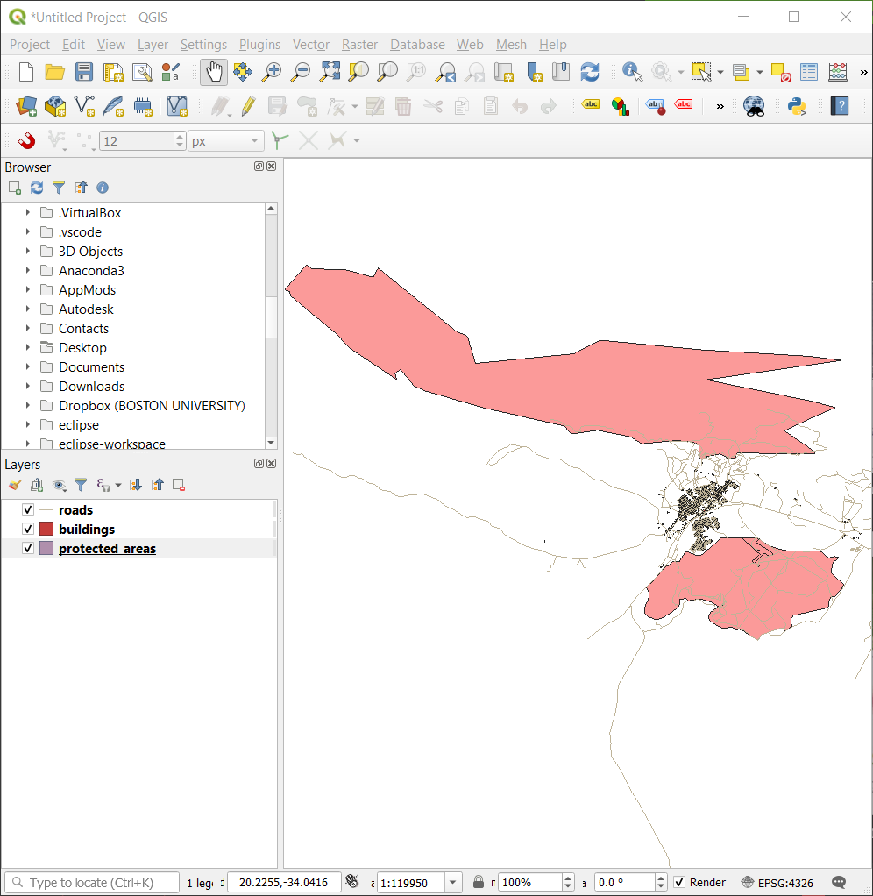
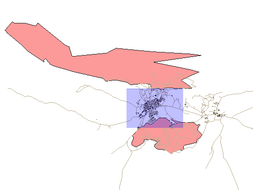
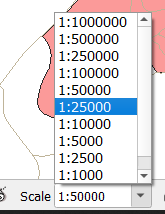
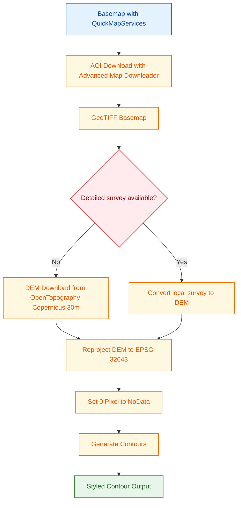
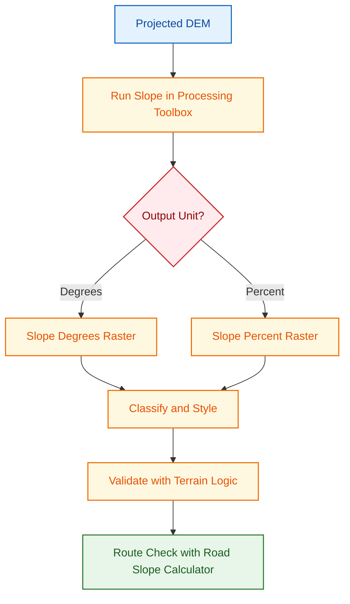
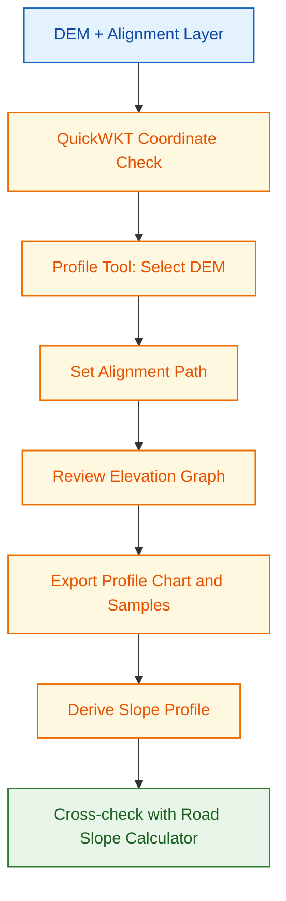
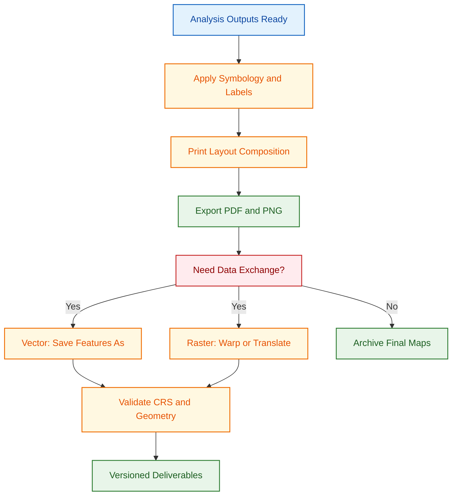

# QGIS Reference

This page is a practical, minimal, high-impact guide to get productive in QGIS quickly for civil engineering workflows.

Core GIS theory is covered in the [Core Concepts and Standards](concepts-and-standards.md) page, so this page focuses on software use and execution.

## What This Page Covers

- QGIS interface overview.
- Must-know basics to start using the software.
- Must-know project configuration settings.
- Practical workflows for basemap, DEM source selection, contour, slope map, and elevation/slope profile.
- Map export and data conversion workflows.
- High-impact plugins and where to use them.
- High-impact native tools organized by toolbar.

## Overview of the Interface

From the QGIS Training Manual (Module 2.1), these are the six UI areas you should identify first:

1. Layers panel and Browser panel.
2. Toolbars.
3. Map canvas.
4. Status bar.
5. Side toolbar.
6. Locator bar.

Why this matters in daily work:

- Layers panel and Browser panel: control draw order, visibility, and quick data discovery from folders/databases.
- Toolbars: reduce clicks for common actions like add layer, pan/zoom, and save/export.
- Map canvas: where you visually validate alignment, overlaps, and output quality.
- Status bar: quickly verify CRS, scale, coordinates, and map units before measurement.
- Side toolbar: fast entry point for layer loading and layer creation actions.
- Locator bar: fastest way to find tools, algorithms, layers, and settings using search.

## Must-Know Basics to Get Started

### Start and save the project correctly

1. Open QGIS and save immediately as a `.qgz` project.
2. Keep project and data in a consistent folder structure.
3. Save frequently while processing large rasters.

### Add layers using Data Source Manager

1. Open Data Source Manager.
2. Add vector or raster layers from known sources.
3. Confirm the layer loads in both Layers panel and map canvas.

### Fix layer order for readable maps

Move polygon context layers below linear and point engineering layers.

### Navigate map canvas with confidence

- Use Pan, Zoom In, Zoom Out, Zoom Last/Next, and Zoom Full Extent.
- Set working scale directly from status bar when needed.

## Must-Know Basic Configuration

Use these settings before starting analysis work:

| Setting area       | What to set                                                             | Why it matters                             |
| ------------------ | ----------------------------------------------------------------------- | ------------------------------------------ |
| Project CRS        | Set project CRS to working projected CRS (for this context: EPSG:32643) | Ensures metric calculations are reliable   |
| Layer CRS check    | Verify each incoming layer CRS before analysis                          | Prevents layer misalignment                |
| Save paths         | Use relative paths in project settings                                  | Makes project portable across systems      |
| Browser panel      | Keep Browser panel visible                                              | Speeds up adding and managing data         |
| Processing outputs | Save outputs with clear names and units                                 | Avoids overwrite and interpretation errors |

Quick quality check before any measurement:

- Confirm CRS in status bar.
- Confirm map units are meters.
- Confirm DEM and vector layers overlap correctly.

## Must-Know Native Tools by Toolbar

- Project Toolbar: use New Project, Open, Save, and Save As to control versions and avoid accidental overwrite. Use New Print Layout to move from analysis to report-ready outputs.
- Map Navigation Toolbar: Pan, Zoom In/Out, Zoom Full Extent, and Zoom to Layer are the fastest tools for QA and visual checks during analysis.
- Selection Toolbar: Select Features by Area/Polygon and Clear Selection are essential before attribute filtering, editing, and exporting subsets.
- Attribute Toolbar: Open Attribute Table, Field Calculator, and Identify Features support quick validation, data cleaning, and derived field creation.
- Data Source Manager Toolbar: Open Data Source Manager gives structured access to vector, raster, database, and delimited text sources from one dialog.
- Digitizing Toolbar: Toggle Editing, Add Feature, Vertex Tool, and Save Layer Edits are core controls for geometry creation and correction.
- Snapping Toolbar: Enable Snapping and Snapping Options maintain topological quality by reducing gaps, overlaps, and near-miss vertices.
- Manage Layers Toolbar: Add Layer, Remove Layer, and Layer Styling shortcuts help maintain a clean project stack and consistent map presentation.

## High-Impact Plugins

### Install and Setup (One Time)

1. Open Plugins > Manage and Install Plugins.
2. Install required plugins from the All tab.
3. Enable plugin toolbars/panels from View > Toolbars or View > Panels if needed.
4. Restart QGIS when prompted.

Plugins used in this reference:

- QuickWKT for coordinate checks.
- OSM Place Search for quick AOI location and basemap validation.
- NextGIS QuickMapServices for quick basemap loading.
- Advanced Map Downloader for AOI basemap download.
- OpenTopography DEM Downloader for preliminary Copernicus DEM.
- Profile Tool for elevation profiles.
- Road Slope Calculator for route slope checks.

Use plugins selectively. Built-in tools should be your default for reproducible workflows.

## Critical Elevation Source Rule

Use this decision before contour, slope, and profile generation:

- Preliminary analysis without detailed site survey: use Copernicus 30m DEM.
- Detailed analysis with detailed site survey: convert local site survey to DEM and use it for derived products.
- Do not use Copernicus 30m DEM for detailed grading/alignment decisions when survey-derived DEM is available.

## Practical Workflows

### Workflow A: Basemap Workflow

Goal: prepare AOI-specific basemap raster for consistent project context.

1. Load online basemap with NextGIS QuickMapServices.
2. Open Advanced Map Downloader and set AOI extent.
3. Choose zoom level based on required detail and file size.
4. Download and save output as GeoTIFF.
5. Reproject with Raster > Projections > Warp (Reproject) to EPSG:32643 if needed.
6. Validate alignment against known control layers.

Output: project basemap raster ready for overlay and map layouts.

### Workflow B: Preliminary DEM Workflow (Copernicus 30m)

Goal: create preliminary analysis DEM when detailed site survey is not available.

1. Open OpenTopography DEM Downloader and select Copernicus DEM source.
2. Set AOI and download DEM.
3. Save DEM with clear naming (example: `dem_copernicus30m_32643_v1.tif`).
4. Reproject using Raster > Projections > Warp (Reproject) to EPSG:32643.
5. Check no-data regions and clipping needs before analysis.

Output: projected preliminary DEM ready for initial contour, slope, and profile screening.

### Workflow C: Convert Local Site Survey to DEM

Goal: generate detailed terrain DEM from detailed survey points for design-grade derived products.

1. Load cleaned survey point layer with `Easting`, `Northing`, and `Elevation` fields.
2. Confirm project CRS is projected (preferably EPSG:32643) and points align with AOI.
3. Run Processing Toolbox > Interpolation > TIN interpolation (or IDW when required by data pattern).
4. Set interpolation field to `Elevation` and define AOI extent.
5. Choose output resolution based on survey point spacing (for example 0.5 m to 2 m).
6. Save output DEM with clear naming (example: `dem_survey_32643_v1.tif`).
7. Validate DEM against known survey points and investigate spikes/pits before deriving products.

Output: survey-derived DEM ready for detailed contour, slope, and profile analysis.

### Workflow D: Set DEM Zero Pixels to NoData (Save Raster Layer As)

Goal: replace non-real elevation pixels (value 0) with NoData so terrain outputs are not distorted.

1. Right-click DEM layer > Export > Save As....
2. Set output file name and format (GeoTIFF).
3. In the Save Raster Layer As dialog, open the No data values section.
4. Click the + button to add a new NoData value.
5. Enter 0 as the NoData value and click OK.
6. Reload output DEM and verify that 0-valued pixels are treated as NoData.
7. Use this cleaned DEM for contour, slope, and profile workflows.

Output: cleaned DEM with 0-value artifacts removed from analysis.

### Workflow E: Contour Workflow

Goal: derive contour lines for terrain interpretation and communication.

1. Open Processing Toolbox > GDAL > Raster extraction > Contour.
2. Select projected DEM as input (Copernicus 30m for preliminary, survey-derived for detailed).
3. Set contour interval based on project scale (for example 1 m, 2 m, or 5 m).
4. Save output as GeoPackage or Shapefile.
5. Style major/minor contours and label elevation values.
6. Record contour interval in layer name or map metadata.

Output: contour layer suitable for preliminary review or detailed design, based on DEM source.

### Workflow F: Build a Slope Map from DEM

Goal: identify steep zones for route feasibility and design risk checks.

1. Load DEM raster and confirm it is in projected CRS (preferably EPSG:32643).
2. Confirm DEM source matches analysis stage (Copernicus 30m for preliminary, survey-derived for detailed).
3. Open Processing Toolbox > GDAL > Raster analysis > Slope.
4. Set output unit (degrees or percent) based on design requirement.
5. Save output as GeoTIFF (example: `slope_percent_32643.tif`).
6. Apply a clear graduated color ramp and classify critical ranges.
7. Validate high-slope areas against known terrain or contour logic.
8. For alignment-specific slope summary, run Road Slope Calculator.

Output: a slope raster that supports feasibility, alignment screening, and risk communication.

### Workflow G: Generate Elevation and Slope Profile Along Alignment

Goal: evaluate rise-fall behavior and gradient suitability along a line (road, drain, pipeline).

1. Load DEM and alignment line layer.
2. Confirm DEM source matches objective (preliminary screening vs detailed design).
3. Use QuickWKT to verify key coordinates when source alignment quality is uncertain.
4. Open Profile Tool and select DEM as profile source.
5. Choose alignment line as profile path.
6. Review elevation graph for abrupt transitions and critical points.
7. Export profile chart and sampled values.
8. Derive slope profile from sampled values (delta elevation over distance).
9. Cross-check route gradients using Road Slope Calculator.

Output: elevation profile plus slope profile summary for engineering review.

## Must-Know Basic Tool Paths

- Plugin Manager: Plugins > Manage and Install Plugins.
- Data Source Manager: Layer > Add Layer > Add Layer.
- Warp (Reproject): Raster > Projections > Warp (Reproject).
- Interpolation (TIN/IDW): Processing Toolbox > Interpolation.
- Save Raster Layer As: Right-click raster layer > Export > Save As....
- Contour: Processing Toolbox > GDAL > Raster extraction > Contour.
- Slope: Processing Toolbox > GDAL > Raster analysis > Slope.
- Print Layout: Project > New Print Layout.
- Save Features As: Right-click layer > Export > Save Features As.

## Map Making and Export Workflow

1. Finalize layer symbology and labels for readability.
2. Open Project > New Print Layout and add map frame.
3. Insert title, legend, north arrow, scale bar, and coordinate grid as needed.
4. Add metadata text: CRS, data date, source, contour interval (if relevant).
5. Export as PDF for reports and PNG for quick sharing.

## Data Conversion Workflow

1. Use Save Features As for vector conversion (GeoPackage, Shapefile, DXF, KML/KMZ).
2. Use Raster > Projections > Warp (Reproject) for raster CRS conversion.
3. Use GDAL Translate (Convert format) for raster format conversion where needed.
4. Recheck CRS and geometry after conversion.
5. Keep converted outputs in a dedicated folder with versioned naming.

## Quality Control Checklist

- Project CRS is verified before processing.
- Input/output file names include CRS and product purpose.
- DEM source is documented for each terrain-derived output (Copernicus 30m or survey-derived).
- Contour interval and slope unit are documented.
- Profile outputs are exported and archived with date/version.
- Exported maps include legend, scale, north arrow, and source metadata.

## References and Image Sources

- [QGIS Training Manual - Module 2: Creating and Exploring a Basic Map](https://docs.qgis.org/3.44/en/docs/training_manual/basic_map/index.html)
- [Lesson 2.1: An Overview of the Interface](https://docs.qgis.org/3.44/en/docs/training_manual/basic_map/overview.html)
- [Lesson 2.2: Adding Your First Layers](https://docs.qgis.org/3.44/en/docs/training_manual/basic_map/preparation.html)
- [Lesson 2.3: Navigating the Map Canvas](https://docs.qgis.org/3.44/en/docs/training_manual/basic_map/mapviewnavigation.html)

Screenshots on this page are sourced from the QGIS Training Manual (QGIS Project Documentation).

## Related Pages

- [Core Concepts and Standards](concepts-and-standards.md)
- [Google Earth Pro Reference](google-earth-pro-reference.md)
- [Interoperability Workflow](interoperability-workflow.md)
- [Practical Execution Guide](practical-execution-guide.md)
